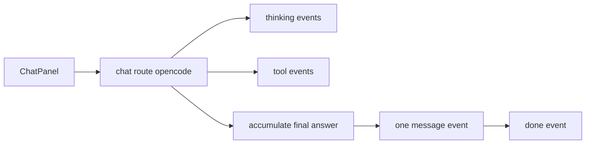

# Normalize Opencode Stream Events

## Objective

Make `opencode` streaming emit:

- `thinking` events for reasoning/tool progress
- a single final `message` event containing the completed assistant answer

while leaving `claude-sdk` behavior unchanged and avoiding regressions in the current UI.

## Current Contract Gap

- Backend currently streams answer chunks as `type: "text"` in `[/Users/bugo/Documents/Developer/aui/agent-builder-bff/src/app/api/sessions/[id]/chat/route.ts](/Users/bugo/Documents/Developer/aui/agent-builder-bff/src/app/api/sessions/[id]/chat/route.ts)`.
- Frontend appends only `text|thinking|tool` events in `[/Users/bugo/Documents/Developer/aui/agent-builder-bff/src/components/app-shell.tsx](/Users/bugo/Documents/Developer/aui/agent-builder-bff/src/components/app-shell.tsx)`.
- Stream type definitions currently do not include `message` in `[/Users/bugo/Documents/Developer/aui/agent-builder-bff/src/lib/types.ts](/Users/bugo/Documents/Developer/aui/agent-builder-bff/src/lib/types.ts)`.

Essential current behavior:

```288:309:/Users/bugo/Documents/Developer/aui/agent-builder-bff/src/app/api/sessions/[id]/chat/route.ts
if (part?.type === "reasoning" || part?.reasoning) {
  // emits thinking chunks
  controller.enqueue(encoder.encode(`data: ${JSON.stringify({ type: "thinking", content })}\n\n`));
} else if (part?.type === "text") {
  // currently emits text chunks
  controller.enqueue(encoder.encode(`data: ${JSON.stringify({ type: "text", content })}\n\n`));
}
```

## Implementation Plan

1. Update opencode stream assembly in `[/Users/bugo/Documents/Developer/aui/agent-builder-bff/src/app/api/sessions/[id]/chat/route.ts](/Users/bugo/Documents/Developer/aui/agent-builder-bff/src/app/api/sessions/[id]/chat/route.ts)`

- Accumulate assistant text internally while processing `message.part.updated` events.
- Continue emitting `thinking` and `tool` events in real time.
- Stop emitting `type: "text"` for opencode path.
- On `session.idle` (just before `done`), emit one `type: "message"` event with the finalized assistant content.
- Preserve existing `validation`, `error`, and `done` behavior.

1. Update frontend event intake in `[/Users/bugo/Documents/Developer/aui/agent-builder-bff/src/components/app-shell.tsx](/Users/bugo/Documents/Developer/aui/agent-builder-bff/src/components/app-shell.tsx)`

- Extend `applyEvent` to accept `message` events and map them to the assistant text segment.
- Keep handling `text` as fallback compatibility (needed for `claude-sdk` which remains unchanged).
- Update the stream parsing condition so UI applies `message` events the same way as current text rendering.

1. Update shared stream typing in `[/Users/bugo/Documents/Developer/aui/agent-builder-bff/src/lib/types.ts](/Users/bugo/Documents/Developer/aui/agent-builder-bff/src/lib/types.ts)`

- Add `message` to `StreamEvent.type` union.
- Keep `text` temporarily for compatibility until/if `claude-sdk` is migrated.

1. Verification

- Manual smoke-test with `opencode` session:
  - confirm incremental `thinking` still appears during run
  - confirm exactly one final `message` event renders the assistant answer
  - confirm no duplicate assistant text appears
- Regression check with `claude-sdk` session:
  - confirm existing `text` stream still renders normally

## Data Flow After Change



## Risk Controls

- Keep dual support (`message` + `text`) in frontend to avoid breaking provider-specific behavior.
- Emit final `message` before `done` to preserve current lifecycle assumptions in UI.
- Do not alter claude-sdk stream proxy contract in this change (scope-limited as requested).
