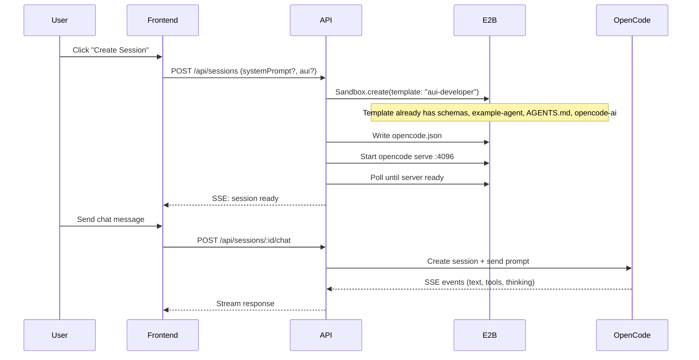

# Replace Git Clone with E2B Sandbox Template

## Current State Analysis

**How it works now:**

1. User provides `repoUrl` + `branch` in the UI
2. Backend creates a **blank E2B sandbox** (no template) via `Sandbox.create({})`
3. Runs `git clone` to pull schema/agent files into `/home/user/project`
4. Installs `opencode-ai` via npm at runtime
5. Creates `opencode.json` config
6. Starts `opencode serve` on port 4096
7. Deploy pushes changes back to GitHub via git commit/push

**What's good:**

- The sandbox template in `sandbox-templates/agent-builder/` is already well-structured, with schemas, AGENTS.md, and example agent pre-copied
- The template pre-installs `opencode-ai` and `curl` at build time
- Session reconnection logic is solid
- SSE streaming for session creation progress works cleanly
- OpenCode integration (serve, sessions, events) is correct

**What's not good / needs fixing:**

- The session manager (`session-manager.ts`) creates a **blank sandbox** and does everything from scratch -- it does NOT use the existing template at all
- `opencode-ai` is installed at runtime (slow) even though the template already has it
- `repoUrl` and `branch` are required even though they won't be needed with a template
- The deploy route is tightly coupled to git (commit + push) and won't work without a cloned repo
- The template copies files to `/home/user/` but the app expects them at `/home/user/project/`
- `GITHUB_TOKEN` is passed to sandboxes but won't be needed -- should be removed entirely

## Changes Required

### 1. Update sandbox template paths

**File:** [sandbox-templates/agent-builder/template.ts](sandbox-templates/agent-builder/template.ts)

Change `.setWorkdir('/home/user')` to `.setWorkdir('/home/user/project')` and update the `mkdir` command accordingly. All `.copy()` destinations are relative to workdir, so they'll automatically go to `/home/user/project/schemas/...`, `/home/user/project/example-agent/...`, etc. This keeps the rest of the app code (which expects `/home/user/project`) untouched.

### 2. Update env constants and create `.env.example`

**File:** [src/lib/env.ts](src/lib/env.ts)

- Add `E2B_TEMPLATE` pointing to the template alias (`aui-developer` from `package.json` name)
- **Remove** `GITHUB_TOKEN` entirely -- no longer needed without git clone

**New file:** [.env.example](.env.example)

Create with all required env vars for the user to fill:

```
E2B_API_KEY=
ANTHROPIC_API_KEY=
E2B_TEMPLATE=aui-developer
```

### 3. Rewrite session manager to use template

**File:** [src/lib/session-manager.ts](src/lib/session-manager.ts)

In the `createSession` function, replace the "fresh sandbox" branch (lines 91-205):

- Use `Sandbox.create({ template: env.E2B_TEMPLATE, ... })` instead of blank `Sandbox.create({})`
- **Remove:** `GITHUB_TOKEN` from sandbox `envs` -- no longer needed
- **Remove:** git clone step (lines 106-120)
- **Remove:** OpenCode installation step (lines 122-141) -- already in template
- **Keep:** AUI agent-builder install + login (lines 143-163) -- still runtime-dependent on credentials
- **Keep:** opencode.json creation (lines 165-187) -- needs `ANTHROPIC_API_KEY` which is runtime
- **Keep:** opencode serve start + readiness poll (lines 189-205)

Remove `repoUrl` and `branch` from the function signature entirely. Session object creation should no longer include them.

### 4. Update types

**File:** [src/lib/types.ts](src/lib/types.ts)

```typescript
export interface Session {
  id: string;
  sandboxId: string;
  opencodeSessionId: string;
  opencodeBaseUrl: string;
  status: "creating" | "ready" | "error" | "destroyed";
  createdAt: number;
  systemPrompt?: string;
}

export interface CreateSessionRequest {
  sandboxId?: string;
  systemPrompt?: string;
  aui?: AuiCredentials;
}
```

Remove `repoUrl` and `branch` from both interfaces.

### 5. Update session API route

**File:** [src/app/api/sessions/route.ts](src/app/api/sessions/route.ts)

- Remove the validation requiring `repoUrl` and `branch`
- Update `createSession()` call to match the new signature

### 6. Replace deploy route with file export

**File:** [src/app/api/sessions/[id]/deploy/route.ts](src/app/api/sessions/[id]/deploy/route.ts)

Replace the git-based deploy with a zip-download endpoint:

- Run `tar -czf /tmp/project.tar.gz -C /home/user project` (or zip) in the sandbox to archive the project files (excluding `.opencode`, `opencode.json`, `node_modules`)
- Read the archive bytes from the sandbox via `sandbox.files.read()`
- Return as a downloadable `application/gzip` (or `application/zip`) response with `Content-Disposition: attachment`
- The frontend will trigger a file download instead of showing a git push modal

### 7. Update frontend

**File:** [src/components/app-shell.tsx](src/components/app-shell.tsx)

- **NewSessionModal:** Remove `repoUrl` and `branch` input fields. The "Create" button no longer needs a repo URL to be valid. Keep `sandboxId`, `systemPrompt`, and AUI credentials
- **handleCreateSession:** Update signature to remove `repoUrl`/`branch` params
- **Session header:** Remove repo name / branch display, show something like "AUI Agent Builder" or the session ID instead
- **DeployModal:** Replace with a simple "Export" / "Download" button that triggers the zip download from the new deploy endpoint. No modal needed -- just a direct download action
- **SavedSession storage:** Update `SavedSession` interface to remove `repoUrl`/`branch`
- **RestoreSession:** Update to work without repo/branch

### 8. Rebuild the template

After updating `template.ts`, the template needs to be rebuilt:

```bash
cd sandbox-templates/agent-builder
npm run build:prod
```

This publishes the updated template to E2B with the `aui-developer` alias.

## File Change Summary

| File                                          | Action                                                       |
| --------------------------------------------- | ------------------------------------------------------------ |
| `sandbox-templates/agent-builder/template.ts` | Update workdir to `/home/user/project`                       |
| `src/lib/env.ts`                              | Add `E2B_TEMPLATE` constant                                  |
| `src/lib/session-manager.ts`                  | Use template, remove git clone + npm install                 |
| `src/lib/types.ts`                            | Remove `repoUrl`/`branch` from interfaces                    |
| `src/app/api/sessions/route.ts`               | Remove repoUrl/branch validation                             |
| `src/app/api/sessions/[id]/deploy/route.ts`   | Replace with zip-export endpoint                             |
| `src/components/app-shell.tsx`                | Remove repo/branch fields, replace deploy with export button |

## Flow After Changes


