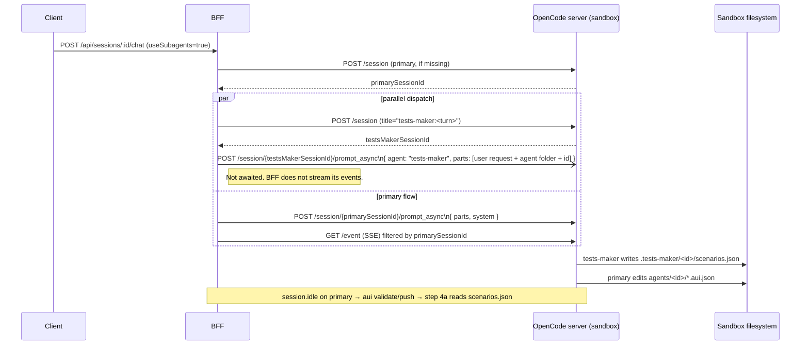

## Why the current setup does not run in parallel

OpenCode's Task tool is synchronous — the parent blocks on the child's `task_result`. The user's own `.opencode/agents/tests-maker.md` already documents the intended architecture: "The BFF chat route spawns you in a separate OpenCode session, in the same sandbox, in parallel with the primary agent's session." The BFF does not currently do that.

Secondary evidence from the trace: the primary invoked `Task({subagent_type: "general", ...})` — not `"tests-maker"` — and the child executed `bash mkdir ...` even though `tests-maker.md` sets `tools.bash: false` and `permission.bash."*": deny`. That proves a generic subagent ran, not the configured `tests-maker`.

OpenCode HTTP API (verified against opencode.ai/docs/server) supports what we need:

- `POST /session` with optional `parentID`/`title` → returns a new `Session`
- `POST /session/:id/prompt_async` body accepts `{ agent?, model?, system?, tools?, parts, ... }` and returns 204 No Content (fire-and-forget)

So: open a second session in the same sandbox, call `prompt_async` with `agent: "tests-maker"`, never await it, and let the primary session run its own prompt at the same time. Both write to the same `/home/user/project` filesystem; primary reads `.tests-maker/<agent_id>/scenarios.json` later in step 4a.

## Data flow (after fix)



## Changes, by file

### 1. [src/app/api/sessions/[id]/chat/route.ts](src/app/api/sessions/[id]/chat/route.ts) and [src/app/api/sessions/poll/[id]/chat/route.ts](src/app/api/sessions/poll/[id]/chat/route.ts)

- Extract a single helper `dispatchTestsMaker({ baseUrl, dir, agentId, userMessage, logger })` that:
  1. `POST ${baseUrl}/session?directory=${dir}` with body `{ title: "tests-maker:<agentId>:<ts>" }` to create a sibling session (no `parentID` — we do not want it treated as a Task child of the primary).
  2. `POST ${baseUrl}/session/<id>/prompt_async?directory=${dir}` with body:

```
     {
       "agent": "tests-maker",
       "parts": [{ "type": "text", "text": <prompt with user request verbatim + agent folder + agent id> }]
     }


```

1. Log and swallow errors. Never throw into the caller. This is best-effort.

- Call `dispatchTestsMaker(...)` right before the primary's `prompt_async` call, only when `useSubagents === true && agentId`. Do **not** `await` it beyond the initial fire (returns as soon as the second `prompt_async` POST returns 204).
- SSE event filter stays as-is. The existing `props.sessionID === activeSessionId` check in `chat/route.ts` already drops events that belong to the tests-maker session, so no UI change is needed.

### 2. [src/lib/v2-chat-prompt.ts](src/lib/v2-chat-prompt.ts) — replace the `testsMakerInstruction` text

Current text tells the primary to invoke `tests-maker` via the Task tool. That is exactly what caused `subagent_type: "general"` in the trace and the synchronous wait. Replace with text that says: "A `tests-maker` session is already running in parallel in this sandbox. Do NOT invoke `tests-maker` via the Task tool. Proceed directly with implementation. In step 4a of validate-and-push, read `/home/user/project/.tests-maker/<agentId>/scenarios.json` and fall back to in-turn design only if missing or stale."

### 3. [sandbox-templates/agent-builder-subagents/opencode.json](sandbox-templates/agent-builder-subagents/opencode.json) — lock out Task invocation

Change `permission.task` from `{ "tests-maker": "allow" }` to `{ "*": "deny", "tests-maker": "deny" }`. Per opencode docs: "When set to `deny`, the subagent is removed from the Task tool description entirely, so the model won't attempt to invoke it." This eliminates the "invent a generic Task call" failure mode we saw in the trace. The subagent remains invocable by the BFF because BFF hits `prompt_async` with `agent: "tests-maker"` directly, which bypasses the Task tool permission.

### 4. [.opencode/skills/tests-maker/SKILL.md](sandbox-templates/agent-builder-subagents/.opencode/skills/tests-maker/SKILL.md) and [.opencode/agents/tests-maker.md](sandbox-templates/agent-builder-subagents/.opencode/agents/tests-maker.md)

- `tests-maker/SKILL.md`: rewrite "How to spawn" to say "You do not spawn tests-maker. The BFF dispatches it as a parallel session on your behalf." Keep "Reuse rules" intact (step 4a behavior is unchanged).
- `tests-maker.md`: keep the "spawned by the BFF in a parallel session" wording it already has. Drop `tools.task: false` (irrelevant in this mode). Keep `hidden: true`, `tools.bash: false`, and the `permission.write` sandboxing.

### 5. [.opencode/skills/validate-and-push/SKILL.md](sandbox-templates/agent-builder-subagents/.opencode/skills/validate-and-push/SKILL.md) — step 4a polling

Primary may reach step 4a before tests-maker finishes. Add a bounded poll: at the start of step 4a, wait up to 30s (check every 2s) for `.tests-maker/<agent_id>/scenarios.json` to exist and parse as JSON. If it appears in time, use it. If not, fall back to in-turn design (existing path). No other runtime-coupling is introduced.

### 6. [template.ts](sandbox-templates/agent-builder-subagents/template.ts)

No template changes required — the `.opencode/agents/tests-maker.md` copy is already there.

## Out of scope

- Hardening the runner/grader logic in `run-batch.js` / `smoke.js`.
- The smoke-test failures in the trace (the agent not saying the discount on turn 0) are an agent-config quality issue, not a subagent-wiring issue, and are separate from this plan.
- Claude-SDK path (`handleClaudeSdkChat`) — tests-maker is OpenCode-only; no change there.

## Validation after implementation

1. Start a session with `useSubagents: true`, send a .aui.json-modifying request.
2. Confirm in logs that two `POST /session` calls happen and the BFF fires `prompt_async` with `agent: "tests-maker"` on the second.
3. Confirm the primary's SSE stream does NOT show a `task` tool call for tests-maker.
4. Confirm `.tests-maker/<agent_id>/scenarios.json` is written by the child session (check file mtime vs primary's first tool call time — child should finish around or before step 4a).
5. Confirm the child session's child agent shows `bash`-tool calls are denied (proves the real tests-maker agent config loaded, not the `general` fallback).
