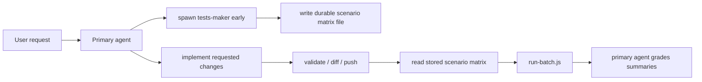

# Add `tests-maker` Subagent

## Goal

Create a real `tests-maker` subagent inside the `agent-builder-subagents` template that takes over test-scenario creation from the primary agent at the start of a chat, stores the generated scenario matrix in a durable file, and lets the primary agent reuse that same output later during post-push evaluation.

## Fact-Based Constraint

The current template’s documented subagent flow is synchronous: the parent agent dispatches workers and waits for them to finish before continuing. That means a `tests-maker` subagent can replace the primary agent’s scenario-creation work and prevent that work from being repeated later, but it will not provide true detached background execution by itself. True non-blocking execution would require a separate background-job mechanism beyond the current OpenCode template.

## Design

## Planned Changes

### 1. Add a real `tests-maker` subagent

Create a new agent definition at [sandbox-templates/agent-builder-subagents/.opencode/agents/tests-maker.md](/Users/bugo/Documents/Developer/aui/agent-builder-bff/sandbox-templates/agent-builder-subagents/.opencode/agents/tests-maker.md).

It should define:

- the subagent’s role as the test-scenario creator the primary agent delegates to
- a strict output contract
- no grading, no pushing, no agent edits beyond writing its scenario-matrix artifact
- a durable handoff format the primary agent can read later
- OpenCode-native subagent metadata from the docs: `mode: subagent`, a clear `description`, and `hidden: true` so it is intended for programmatic invocation rather than normal user `@` usage

### 2. Add a `tests-maker` skill and make it globally visible

Create [sandbox-templates/agent-builder-subagents/.opencode/skills/tests-maker/SKILL.md](/Users/bugo/Documents/Developer/aui/agent-builder-bff/sandbox-templates/agent-builder-subagents/.opencode/skills/tests-maker/SKILL.md) and add it to [sandbox-templates/agent-builder-subagents/opencode.json](/Users/bugo/Documents/Developer/aui/agent-builder-bff/sandbox-templates/agent-builder-subagents/opencode.json) `instructions`.

This skill should cover two sides of the contract:

- **Primary-agent orchestration:** on the first substantive user request, spawn `tests-maker` immediately with the user intent and current agent context.
- **Subagent contract:** generate the reusable scenario matrix the primary agent would otherwise create itself and persist it to a stable file path.

Per the OpenCode docs, this skill is supporting instruction only. It does not replace the need for a real subagent definition. A skill can guide behavior, but a distinct spawned worker requires `.opencode/agents/tests-maker.md`.

Recommended artifact path:

- an agent-scoped draft file under the working agent directory, so the primary agent can safely re-read it later without crossing scope boundaries.

### 3. Add explicit task-permission wiring

Update [sandbox-templates/agent-builder-subagents/opencode.json](/Users/bugo/Documents/Developer/aui/agent-builder-bff/sandbox-templates/agent-builder-subagents/opencode.json) so the primary agent is explicitly allowed to invoke `tests-maker` through the Task tool, instead of relying on undocumented defaults.

This change should also keep the documented OpenCode split clear:

- **agents** define spawned workers
- **skills** provide reusable instructions those agents may load or follow

### 4. Define a durable scenario-matrix artifact

Introduce a single JSON artifact for early test planning, separate from the runtime `.eval-runs/<run_id>/` payloads, but close in shape to the scenario matrix the primary agent already reasons over today.

Recommended shape:

- request summary / source intent
- timestamp or generation marker
- list of scenarios with the same planning fields the primary agent currently uses: `scenario_id`, `scenario_goal`, and `turns[]` with `role`, `text`, and `expected`
- optional notes about uncertain assumptions or missing coverage

This file should be treated as the primary source of truth for later smoke-test payload generation, not as the final post-push execution artifact.

### 5. Update post-push orchestration to consume the stored matrix

Update [sandbox-templates/agent-builder-subagents/.opencode/skills/validate-and-push/SKILL.md](/Users/bugo/Documents/Developer/aui/agent-builder-bff/sandbox-templates/agent-builder-subagents/.opencode/skills/validate-and-push/SKILL.md) so step 4 changes from:

- the primary agent always designing the scenario matrix from scratch after push

to:

- first reading the `tests-maker` scenario file if present
- treating it as the main scenario matrix for the run
- reconciling it against the final `aui diff` only when the implementation drifted from the original user request enough to require adjustment
- falling back to in-turn scenario creation only if the scenario file is missing or clearly stale

This preserves the current grading and `run-batch.js` artifact contract while moving scenario creation out of the primary agent’s later push flow.

### 6. Document the new lifecycle

Update [sandbox-templates/agent-builder-subagents/EVALUATE.md](/Users/bugo/Documents/Developer/aui/agent-builder-bff/sandbox-templates/agent-builder-subagents/EVALUATE.md) so it describes:

- early scenario-matrix creation by `tests-maker`
- later reuse by the primary agent during post-push smoke testing
- the distinction between the stored scenario matrix and `.eval-runs/<run_id>/` execution artifacts
- the synchronous limitation of the current subagent model

### 7. Package the new files into the template

Update [sandbox-templates/agent-builder-subagents/template.ts](/Users/bugo/Documents/Developer/aui/agent-builder-bff/sandbox-templates/agent-builder-subagents/template.ts) to copy:

- [sandbox-templates/agent-builder-subagents/.opencode/agents/tests-maker.md](/Users/bugo/Documents/Developer/aui/agent-builder-bff/sandbox-templates/agent-builder-subagents/.opencode/agents/tests-maker.md)
- [sandbox-templates/agent-builder-subagents/.opencode/skills/tests-maker/SKILL.md](/Users/bugo/Documents/Developer/aui/agent-builder-bff/sandbox-templates/agent-builder-subagents/.opencode/skills/tests-maker/SKILL.md)

## Why No BFF Changes By Default

Because you selected OpenCode `agent-builder-subagents` only, the existing `useSubagents` flow in [src/lib/session-manager.ts](/Users/bugo/Documents/Developer/aui/agent-builder-bff/src/lib/session-manager.ts) already routes those sessions into the correct template. The cleanest first implementation is template-local: subagent definition, skill, instructions, and post-push reuse.

I would avoid app-level prompt/schema changes unless we later need deterministic enforcement outside the template or a true background job model.

## Validation

- Confirm the template contains a new named agent at `.opencode/agents/tests-maker.md`.
- Confirm `opencode.json` loads the new `tests-maker` skill as a global instruction.
- Confirm `opencode.json` explicitly allows the primary agent to invoke `tests-maker` via Task permissions.
- Confirm the primary-agent instructions explicitly say to invoke `tests-maker` at the start of substantive chats.
- Confirm `validate-and-push` consumes the stored scenario matrix before building `.eval-runs/<run_id>/` payloads.
- Confirm `run-batch.js` and the per-scenario summary/grading contract remain unchanged.
- Confirm docs clearly state that early drafting is supported, but true detached background execution is not provided by the current subagent mechanism alone.
