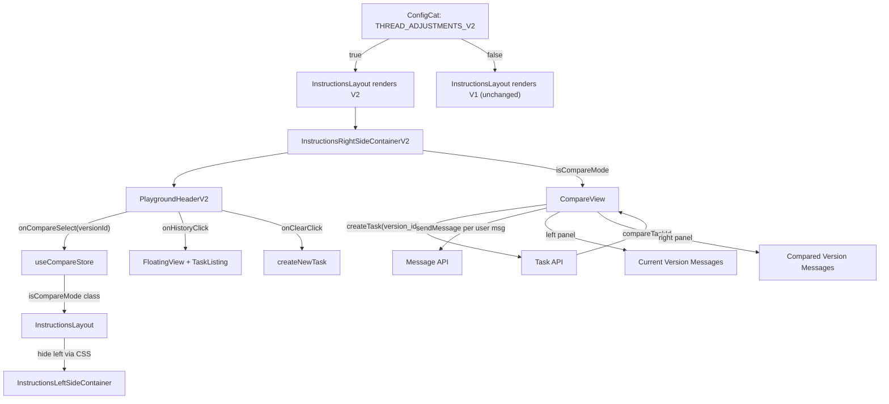

# Thread Adjustments - Compare Mode V2 (opt-3)

## Strategy: V2 Components Behind Feature Flag

All new behavior lives in **new V2 files** created alongside the originals. Existing components (`PlaygroundHeader.tsx`, `InstructionsRightSideContainer.tsx`, `FineTuningView.tsx`) are **not modified**. A ConfigCat feature flag (`THREAD_ADJUSTMENTS_V2`) controls which version renders. Rollback = turn off the flag.

**Existing files touched (minimal, additive-only):**

- [configCatFlags.ts](apps/operator/src/feature-flags/configCatFlags.ts) - add one new flag entry
- [InstructionsLayout.tsx](apps/operator/src/layouts/instructions-layout/InstructionsLayout.tsx) - one conditional to swap V1/V2 right container
- [styles.scss](apps/operator/src/layouts/instructions-layout/styles.scss) - additive CSS for compare mode transitions (no changes to existing rules)

**Everything else is brand new files.**

---

## Context

The Figma design section "Thread Adjustments - opt 3" (node `2269:3763`) defines a reworked thread header and a compare mode for running the same conversation thread against two different agent versions side by side.

**Current architecture (V1 - untouched):**

- [InstructionsLayout.tsx](apps/operator/src/layouts/instructions-layout/InstructionsLayout.tsx) composes left (code editor) + right (thread) containers
- [InstructionsRightSideContainer.tsx](apps/operator/src/layouts/instructions-layout/partials/InstructionsRightSideContainer.tsx) renders `FineTuningView` with a `customHeader` containing Tabs ("New Chat" / "All Threads")
- [PlaygroundHeader.tsx](apps/operator/src/widgets/FineTuningView/partials/PlaygroundHeader.tsx) shows agent chip + title + clear button
- [FineTuningView.tsx](apps/operator/src/widgets/FineTuningView/FineTuningView.tsx) orchestrates thread container, messages, and conversation box

**Key existing patterns to reuse (import, not modify):**

- `useGetAgentVersions` from [agent-versions.ts](apps/operator/src/api/agent-versions.ts) for version list
- `getVersionDisplayLabel` / `isAgentVersionLive` from [versionDropdownFormat.ts](apps/operator/src/components/VersionDropdown/versionDropdownFormat.ts) for display formatting
- `useCurrentAgentAtom` / `useSetSelectedVersionIdAtom` from [current-agent-atom.ts](apps/operator/src/atoms/current-agent-atom.ts) for current agent/version context
- `Popover`, `Chip`, `Flex`, `Button`, `CentralIcon` from `@aui/break`
- `useCreateTask` from [request.ts](apps/operator/src/api/request.ts) for creating compare tasks
- `useMainContext` for `sendMessage` / `createNewTask`
- `IconDifferenceModified` from `central-icons` as the compare icon (alternative to `text-select-dashed` which is not available in central-icons)
- `IconHistory` from `central-icons` for the history button
- `FloatingView` from [FloatingView.tsx](apps/operator/src/widgets/FineTuningView/partials/FloatingView.tsx) for history overlay
- `TaskListing` from [TaskListing](apps/operator/src/widgets/TaskListing) for the history panel

---

## Phase 0: Feature Flag + Swap Point

**Goal:** Register the flag and add a single conditional in the layout to swap V1/V2 right container.

### Add flag to [configCatFlags.ts](apps/operator/src/feature-flags/configCatFlags.ts)

```typescript
THREAD_ADJUSTMENTS_V2: {
  key: 'threadAdjustmentsV2',
  defaultValue: false,
  owner: 'operator-frontend',
  scope: 'global',
  description: 'Enables V2 thread header with compare mode, version display, and history button.',
},
```

### Minimal change to [InstructionsLayout.tsx](apps/operator/src/layouts/instructions-layout/InstructionsLayout.tsx)

```tsx
import { useConfigCatFlag } from '@operator/feature-flags/useConfigCatFlag';
import InstructionsRightSideContainerV2 from './partials/InstructionsRightSideContainerV2';

// Inside the component:
const { value: isThreadV2 } = useConfigCatFlag('THREAD_ADJUSTMENTS_V2');
const isCompareMode = useCompareStore((s) => s.isCompareMode);

// In JSX - swap right container:
{isThreadV2 ? (
  <InstructionsRightSideContainerV2 {/* same props */} />
) : (
  <InstructionsRightSideContainer {/* existing props */} />
)}

// Add compare-mode class to layout wrapper:
className={`instructions-layout ${isEditScreen ? 'edit-screen' : ''} ${playgroundVisible ? 'widget-visible' : ''} ${isThreadV2 && isCompareMode ? 'instructions-layout--compare-mode' : ''}`}
```

This is the **only change** to an existing component's JSX. The conditional is a clean swap with no risk to V1 behavior.

---

## Phase 1: Compare Mode State

**Goal:** Zustand store for compare mode - entirely new file.

### New file: `apps/operator/src/stores/useCompareStore.ts`

```typescript
interface ICompareStoreState {
  compareVersionId: string | null;
  compareTaskId: string | null;
  isCompareLoading: boolean;
  isCompareMode: boolean; // derived: compareVersionId !== null
}

interface ICompareStoreActions {
  setCompareVersionId: (id: string | null) => void;
  setCompareTaskId: (id: string | null) => void;
  setIsCompareLoading: (loading: boolean) => void;
  resetCompare: () => void;
}
```

---

## Phase 2: PlaygroundHeaderV2

**Goal:** New header component with the full Figma-spec layout. No changes to the original `PlaygroundHeader.tsx`.

### New file: `apps/operator/src/widgets/FineTuningView/partials/PlaygroundHeaderV2.tsx`

Layout from left to right:

```
[AGENT chip] [Chat Title (ellipsis)] ...flex spacer... [Version Name] [Compare Dropdown] [History Btn] [+ Btn]
```

Props:

- `chatTitle: string` - selected task title (from `selectedTask?.title || 'New Thread'`)
- `versionLabel: string` - display label of current version (from `getVersionDisplayLabel`)
- `versions: IAgentVersionItem[]` - all versions for compare dropdown
- `currentVersionId: string` - to exclude from compare list
- `activeVersionId: string | null` - to show "Live" badge on versions
- `onCompareSelect: (versionId: string) => void` - enter compare mode
- `onHistoryClick: () => void` - toggle history overlay
- `onClearClick?: () => void` / `isClearDisabled?: boolean` - new task button

Compare dropdown implementation:

- `Popover` trigger: `Button` with `IconDifferenceModified` + "COMPARE" text + `IconChevronDownMedium`
- Popover content: "Compare With" title, search input, scrollable list of versions (excluding `currentVersionId`), each row shows `getVersionDisplayLabel(version)` + status chip via `getVersionStatusDisplayConfig`

### New file: `apps/operator/src/widgets/FineTuningView/partials/PlaygroundHeaderV2.styles.scss`

All V2 header styles namespaced under `.playground-header-v2` to avoid collision with V1 `.playground-header`.

---

## Phase 3: InstructionsRightSideContainerV2

**Goal:** V2 right container that uses `PlaygroundHeaderV2`, removes tabs, adds history overlay and compare mode orchestration.

### New file: `apps/operator/src/layouts/instructions-layout/partials/InstructionsRightSideContainerV2.tsx`

**Key differences from V1:**

- No `Tabs` component, no `selectedTab` state, no `thread-header__tabs-row`
- Uses `PlaygroundHeaderV2` instead of `PlaygroundHeader` + `customHeader`
- History view rendered via `FloatingView` + `TaskListing` (toggled by local `showHistory` state)
- Passes version data to `PlaygroundHeaderV2` (from `useGetAgentVersions` + `useCurrentAgentAtom`)
- On compare select: calls `useCompareStore.setCompareVersionId(id)`
- Renders `CompareView` when `isCompareMode` is true (instead of normal `FineTuningView` thread)

### New file: `apps/operator/src/layouts/instructions-layout/partials/useInstructionsSidesV2.ts`

V2 hook extending `useInstructionsSides` pattern with:

- Version data fetching (agent versions list, selected version, display label)
- Compare mode callbacks
- History toggle state

---

## Phase 4: Compare View Component

**Goal:** Two-panel layout for side-by-side version comparison. All new files.

### New files under `apps/operator/src/widgets/FineTuningView/partials/CompareView/`

**`CompareView.tsx`** - Structure:

```
CompareView
+-- CompareHeader
|   +-- Back button (exits compare mode via resetCompare)
|   +-- "COMPARE MODE" Chip (appearance="simulator")
|   +-- Thread title
|   +-- Thread / Trace tabs (right-aligned)
+-- ComparePanels (flex row, 50/50 split)
    +-- ComparePanel (left - current version)
    |   +-- PanelHeader: {Version Name} + "CURRENT" chip
    |   +-- ConversationMessages (reuses existing component, for current taskId)
    +-- ComparePanel (right - compared version)
        +-- PanelHeader: {Version Name} dropdown (switchable) + kebab menu
        +-- ConversationMessages (for compareTaskId) or loading skeleton
```

**`useCompareView.ts`** - Hook that:

- Reads `compareVersionId`, `compareTaskId`, `isCompareLoading` from `useCompareStore`
- Reads current task messages from `useMessageStore`
- Gets version list from `useGetAgentVersions` (for right panel dropdown)
- Provides `exitCompare()` → `resetCompare()`
- Provides `switchCompareVersion(newId)` → triggers new compare run

**`CompareView.styles.scss`** - Two-column flex layout with:

- `.compare-view` root
- `.compare-view__header` with back button, badge, title, tabs
- `.compare-view__panels` flex row
- `.compare-view__panel` each 50% width with vertical divider
- `.compare-view__panel-header` version label row

**`index.ts`** - Barrel export

---

## Phase 5: Compare API Integration

**Goal:** Run the original thread's user messages against the compared version.

### Logic in `useCompareView.ts`

1. When `compareVersionId` changes (non-null):
   - Call `createTask` with `agent: { agent_id: currentAgent.id, version_id: compareVersionId }`
   - Store returned task ID via `setCompareTaskId`
2. Extract user messages from current thread (`taskMessages[currentTaskId]`)
3. For each user message sequentially:
   - `sendMessage({ messageText, regenerateTaskId: compareTaskId })`
   - Wait for agent response before sending next
4. Compare messages accumulate in `useMessageStore.taskMessages[compareTaskId]`
5. Handle errors with `toast.error()`

**Alternative considered:** `rerunThreadMessage` - rejected because it mutates the original task chain. We want an independent task for clean comparison.

---

## Phase 6: Thread/Trace Navigation (Scaffolding)

**Goal:** Thread/Trace toggle in compare header. Trace content is a follow-up.

- `Thread` tab (default): conversation messages in both panels
- `Trace` tab (scaffold): placeholder with interaction navigation `< Interaction #N >` and code/JSON panels per Figma node `2269:5928`

---

## Additive SCSS in [styles.scss](apps/operator/src/layouts/instructions-layout/styles.scss)

New rules appended (no existing rules modified):

```scss
.instructions-layout--compare-mode {
  .left-side-container {
    width: 0 !important;
    min-width: 0 !important;
    overflow: hidden;
    opacity: 0;
    pointer-events: none;
    transition: width 0.3s ease, opacity 0.2s ease;
  }
  .right-side-container {
    width: 100% !important;
    transition: width 0.3s ease;
  }
}
```

---

## Data Flow Diagram



---

## Files Summary

**Existing files with minimal additive changes (3 files):**

- `apps/operator/src/feature-flags/configCatFlags.ts` - add `THREAD_ADJUSTMENTS_V2` flag entry
- `apps/operator/src/layouts/instructions-layout/InstructionsLayout.tsx` - conditional V1/V2 swap + compare-mode class
- `apps/operator/src/layouts/instructions-layout/styles.scss` - append compare-mode CSS rules

**All new files (10 files):**

- `apps/operator/src/stores/useCompareStore.ts`
- `apps/operator/src/widgets/FineTuningView/partials/PlaygroundHeaderV2.tsx`
- `apps/operator/src/widgets/FineTuningView/partials/PlaygroundHeaderV2.styles.scss`
- `apps/operator/src/layouts/instructions-layout/partials/InstructionsRightSideContainerV2.tsx`
- `apps/operator/src/layouts/instructions-layout/partials/useInstructionsSidesV2.ts`
- `apps/operator/src/widgets/FineTuningView/partials/CompareView/CompareView.tsx`
- `apps/operator/src/widgets/FineTuningView/partials/CompareView/useCompareView.ts`
- `apps/operator/src/widgets/FineTuningView/partials/CompareView/styles.scss`
- `apps/operator/src/widgets/FineTuningView/partials/CompareView/index.ts`

**Existing files NOT touched:**

- `PlaygroundHeader.tsx` (V1 remains as-is)
- `InstructionsRightSideContainer.tsx` (V1 remains as-is)
- `FineTuningView.tsx` (V1 remains as-is)
- `useFineTuningView.ts` (remains as-is)
- `chat-page/styles.scss` (V1 styles remain as-is)
