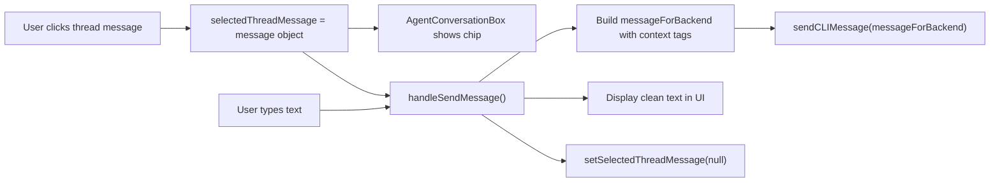

# Thread Context to Agent

## Current State

- When a user clicks a thread message in the conversation, `handleSelectThreadMessage` in `useMessage.ts` calls `setSelectedThreadMessage({ ...message, interactionNumber })`, storing the full message object.
- `AgentConversationBox.tsx` shows a UI chip with the interaction number and a close button.
- `handleSendMessage` in `useAgentBuilder.ts` clears `selectedThreadMessage` to `null` after sending, but **never includes it** in the actual message payload sent to `sendCLIMessage`.

## Data Flow



## Changes

### 1. `useAgentBuilder.ts` -- inject context into the backend message

In [useAgentBuilder.ts](apps/operator/src/widgets/AgentBuilder/useAgentBuilder.ts), inside `handleSendMessage`:

- **Capture** `selectedThreadMessage` at the top of the function (before it gets cleared).
- **Build two versions of the message:**
  - `displayMessage` -- the clean user text (what goes into the `messages` state array and is shown in the UI).
  - `messageForBackend` -- if `selectedThreadMessage` exists, prepend the context block:

```typescript
const traceContext = selectedThreadMessage
  ? `[Interaction Context (Trace Info)]\n${JSON.stringify(
      selectedThreadMessage
    )}\n[/Interaction Context (Trace Info)]\n\n`
  : "";
const messageForBackend = traceContext + message;
```

- **Pass `messageForBackend**`to`sendCLIMessage(...)`as the`message` field (line ~221).
- **Keep `message` (the clean text)** for the UI: the `setMessages` call on line ~197 continues to use `message` (no context tags in the displayed bubble).
- **Update the first-chunk guard** (line ~238): compare `chunk.trim()` against `messageForBackend.trim()` instead of `message.trim()`, since the backend may echo back the full payload including context tags.

### 2. No changes needed in other files

- `AgentConversationBox.tsx` -- already renders the chip and clear button correctly; no changes needed.
- `useAgentBuilderStore.ts` -- store shape is fine as-is.
- `cliConnectionApi.ts` -- `sendCLIMessage` already accepts a `message: string` and passes it to the backend; no modification required.
