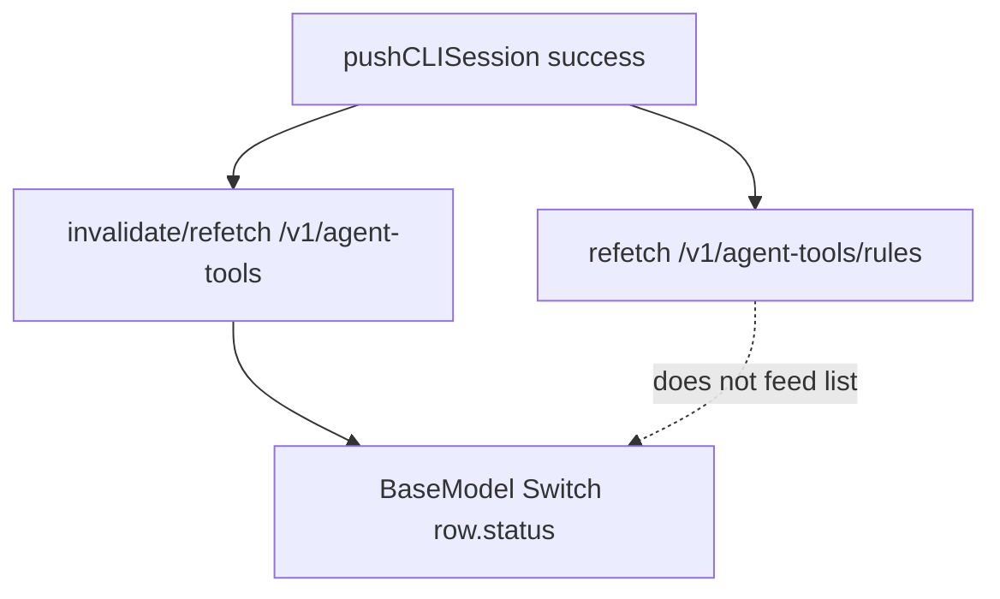

# Tool status not updating after Agent Builder push

## What drives the switch UI

- `[BaseModel.tsx](apps/operator/src/pages/base-model/BaseModel.tsx)` renders `Switch` with `checked={row.status}` where `row` comes from `toolsWithOptimisticState` in `[useBaseModel.tsx](apps/operator/src/pages/base-model/useBaseModel.tsx)`.
- `filteredTools` ultimately comes from `combinedActivatedWorkflow` in `[useWorkflowList.ts](apps/operator/src/pages/base-model/hooks/useWorkflowList.ts)`, built from `**preservedSortedTools**`, which is synced from `**dataWorkflowsResp**` returned by `[useGetWorkflowsByScope](apps/operator/src/api/workflows.ts)` → `[useFetchAgentTools](libs/api/src/api/AgentSettings/AgentToolsApi/useAgentToolsApi.ts)` → **GET `/v1/agent-tools`** (see `TAgentTool.status` in `[useAgentToolsApi.ts](libs/api/src/api/AgentSettings/AgentToolsApi/useAgentToolsApi.ts)`).

So the React Query cache for `**/v1/agent-tools**` (with scoped `params`) must refetch after a successful CLI push for the toggles to match the backend.

## What happens today on push success

In `[useAgentBuilder.ts](apps/operator/src/widgets/AgentBuilder/useAgentBuilder.ts)` (push success branch, ~807+):

1. `**invalidateQueries` / `refetchQueries` on `/v1/agent-tools/rules**` — this targets **rules** only. The query key prefix is `**/v1/agent-tools/rules`**, which does not match the list query `**/v1/agent-tools`** + params (different path). So this **does not** refresh tool `status` for the list.
2. `**refreshAndSyncAgentTools()`** from `[useRefreshAgentTools.ts](apps/operator/src/hooks/useRefreshAgentTools.ts)` — this **does** use `queryKey: ['/v1/agent-tools']` and invalidates + refetches, then syncs `selectedWorkflow` in the right-side store. This is the **intended fix for the list.
3. **Problems with (2)**:

- It is called as `**refreshAndSyncAgentTools().catch(() => {})`** with **no `await`**, so ordering relative to evaluate/other work is not guaranteed and failures are **silently dropped.
- If refetch fails or does not run, the UI stays stale until a full reload (matches the Jira report).

## Recommended implementation

### 1. Make agent-tools list refresh reliable (primary)

In `[useAgentBuilder.ts](apps/operator/src/widgets/AgentBuilder/useAgentBuilder.ts)`, in the **successful push** `.then` callback (same block as today’s invalidations):

- `**await refreshAndSyncAgentTools()`** (the hook already returns an async function that invalidates + refetches `/v1/agent-tools`). Turn the `.then` callback into `async` and await it, or chain `.then(() => refreshAndSyncAgentTools())` and **avoid swallowing errors (at least `console.error` in `catch` for debugging).
- Optionally **duplicate** with an explicit `await queryClient.refetchQueries({ queryKey: ['/v1/agent-tools'], exact: false })` only if you want belt-and-suspenders (should be redundant with `useRefreshAgentTools`).

Keep `**/v1/agent-tools/rules` invalidation if other UI still depends on it; it is not a substitute for the list.

### 2. Ensure `preservedSortedTools` picks up refetched data (secondary, edge case)

In `[useWorkflowList.ts](apps/operator/src/pages/base-model/hooks/useWorkflowList.ts)`, the effect that rebuilds `preservedSortedTools` from `dataWorkflowsResp` (lines ~84–103) depends only on `[dataWorkflowsResp]`. If React Query ever keeps the **same reference** with nested updates, the effect might not run. Mitigation:

- Destructure `**dataUpdatedAt`** (and/or `**isFetched`**) from `useGetWorkflowsByScope()`and add`\*\*dataUpdatedAt\*\` to the effect dependency array so any successful refetch re-runs the merge.

### 3. Optimistic overlay vs external updates (only if still flaky after 1–2)

`[useBaseModel.tsx](apps/operator/src/pages/base-model/useBaseModel.tsx)` merges `optimisticStatusState` over `filteredTools`. The cleanup effect (lines ~144–161) **only prunes** keys for removed workflows; it does **not** drop stale optimistic values when the **server** `status` changes from an external source (e.g. Agent Builder). If reproduction still shows wrong switches **after** fixing refetch, add logic to **drop optimistic entries when they disagree with the latest server `status` for that workflow** _without_ breaking in-flight manual toggles (e.g. only clear when not loading, or compare with a ref of previous `filteredTools`). Treat this as a follow-up if needed.

## Verification

- On staging: toggle a tool **only** via Agent Builder, push succeeds → Base Model tool row `Switch` matches backend **without** full page refresh.
- Regression: manual toggle still works; no extra flicker on normal edits.

## Files to touch

- `[apps/operator/src/widgets/AgentBuilder/useAgentBuilder.ts](apps/operator/src/widgets/AgentBuilder/useAgentBuilder.ts)` — await `refreshAndSyncAgentTools` (async handler), improve error visibility.
- `[apps/operator/src/pages/base-model/hooks/useWorkflowList.ts](apps/operator/src/pages/base-model/hooks/useWorkflowList.ts)` — optional `dataUpdatedAt` on `useGetWorkflowsByScope` + effect deps.
- `[apps/operator/src/pages/base-model/useBaseModel.tsx](apps/operator/src/pages/base-model/useBaseModel.tsx)` — only if optimistic overlay still masks updates after the above.
