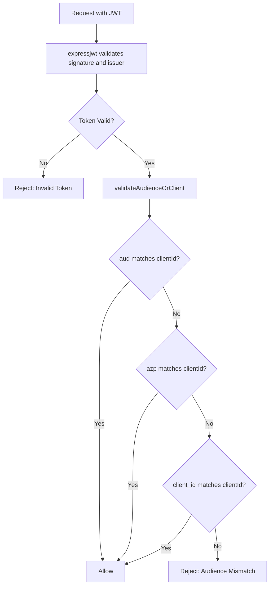

# Universal OIDC Guard Implementation

This plan implements a provider-agnostic OIDC guard that handles the varying conventions of different identity providers, and fixes the failing test from the module refactor.

## Part 1: Fix Failing Test (Import Path Issue)

The test fails because `src/knowledge-hub-public/service/knowledge-hub-public.service.module.ts` incorrectly uses an absolute import path. The file currently has a relative import that works at compile time, but the terminal output shows there was a file with `'src/database/...'`. I see the current file is correct, but let's verify and ensure consistency.

**File**: [`src/knowledge-hub-public/service/knowledge-hub-public.service.module.ts`](src/knowledge-hub-public/service/knowledge-hub-public.service.module.ts)

The import path should be relative:
```typescript
import { PrismaModule } from '../../database/prisma/prisma.module';
```

This appears correct in the current file. If the test still fails, the issue may be a stale cache or a different file. We will verify this during implementation.

---

## Part 2: Universal OIDC Guard Refactor

### 2.1 Update Types File

**File**: [`src/auth/openid-auth.guard.types.ts`](src/auth/openid-auth.guard.types.ts)

Add a type guard helper for checking properties on `unknown` payloads:

```typescript
// Helper to check if a property exists on an unknown object
export function hasProperty<K extends string>(
  obj: unknown,
  key: K,
): obj is Record<K, unknown> {
  return typeof obj === 'object' && obj !== null && key in obj;
}
```

### 2.2 Refactor `getOrCreateMiddleware` in Guard

**File**: [`src/auth/openid-auth.guard.ts`](src/auth/openid-auth.guard.ts)

Key changes:
1. Normalize authority to both slash and non-slash versions
2. Disable default `audience` validation in `express-jwt`
3. Perform manual, universal audience/client validation after middleware runs



### 2.3 Add `validateAudienceOrClient` Method

This method uses `unknown` type and type guards to safely check for the presence of `aud`, `azp`, and `client_id` claims without using `any`.

```typescript
private validateAudienceOrClient(token: unknown, expectedClientId: string): boolean {
  if (!hasProperty(token, 'aud') && !hasProperty(token, 'azp') && !hasProperty(token, 'client_id')) {
    return false;
  }

  // Check 'aud' (string or string[])
  if (hasProperty(token, 'aud')) {
    const audiences = token.aud;
    if (Array.isArray(audiences) && audiences.includes(expectedClientId)) return true;
    if (audiences === expectedClientId) return true;
  }

  // Check 'azp' (Clerk, Google)
  if (hasProperty(token, 'azp') && token.azp === expectedClientId) return true;

  // Check 'client_id' (legacy/custom)
  if (hasProperty(token, 'client_id') && token.client_id === expectedClientId) return true;

  return false;
}
```

### 2.4 Re-export `AuthenticatedRequest`

Ensure the type is re-exported from the guard file so the controller can import it:

```typescript
export { AuthenticatedRequest } from './openid-auth.guard.types';
```

---

## Summary of File Changes

| File | Change |
|------|--------|
| `src/auth/openid-auth.guard.types.ts` | Add `hasProperty` type guard helper |
| `src/auth/openid-auth.guard.ts` | Refactor `getOrCreateMiddleware` for universal OIDC support; add `validateAudienceOrClient`; re-export `AuthenticatedRequest` |