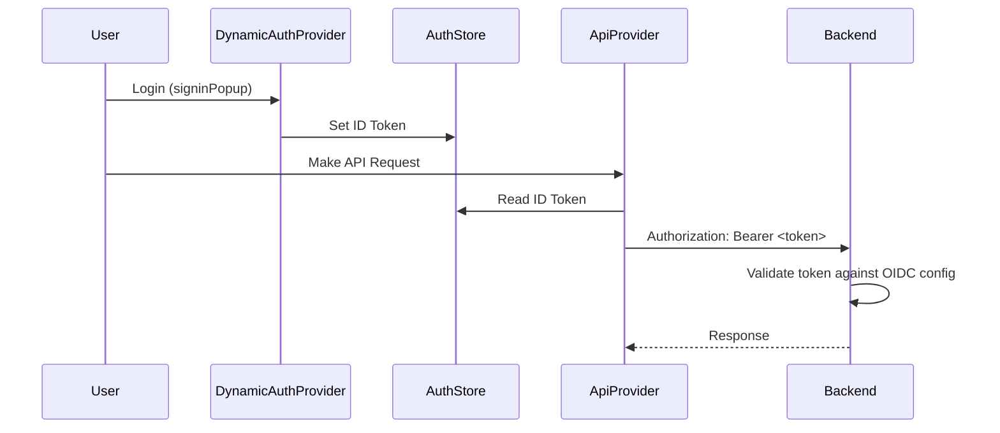

## Plan: Update Frontend Authentication Headers for New Backend OIDC Guard

### Current State Analysis

- **Backend**: New `OpenIdAuthGuard` expects the ID Token in the standard `Authorization: Bearer <token>` header and validates it against OIDC configuration fetched from S3.
- **Frontend**: Currently sends a custom `x-auth-audience` header and does not attach the user's ID Token to API requests.

### Proposed Changes

#### 1. Create a Global Auth Store for Token Access

**File**: [`src/app/store/auth-store.tsx`](src/app/store/auth-store.tsx) (New File)

- Create a Zustand store to hold the current ID Token.
- This store will be updated by the `DynamicAuthProvider` when the user authenticates.
- The `ApiProvider` will read from this store to attach the token to requests.

#### 2. Update DynamicAuthProvider to Store Token

**File**: [`src/lib/providers/dynamic-auth-provider.tsx`](src/lib/providers/dynamic-auth-provider.tsx)

- Import the new auth store.
- Use the `useAuth` hook to listen for authentication state changes.
- When `auth.isAuthenticated` is true, extract `auth.user?.id_token` and save it to the global auth store.
- When the user logs out, clear the token from the store.

#### 3. Update ApiProvider to Use Bearer Token

**File**: [`src/lib/contexts/ApiProvider.context.tsx`](src/lib/contexts/ApiProvider.context.tsx)

- Import the new auth store.
- Replace the existing request interceptor logic (lines 34-49).
- Remove the `x-auth-audience` header injection.
- Add logic to read the ID Token from the auth store and attach it as `Authorization: Bearer <token>`.
- Handle cases where the token is null (user not authenticated).

#### 4. (Optional) Create a Hook for Token Access

**File**: [`src/hooks/use-auth-token.ts`](src/hooks/use-auth-token.ts) (New File)

- A simple custom hook that returns the current token from the store.
- This provides a clean abstraction for any component that might need direct token access in the future.

### Implementation Steps

1.  **Create Auth Store**: Define the Zustand store with `token` and `setToken`/`clearToken` actions.
2.  **Modify DynamicAuthProvider**: Add `useEffect` hooks to sync auth state with the store.
3.  **Modify ApiProvider**: Rewrite the request interceptor to read from the auth store and set the `Authorization` header.
4.  **Test**: Verify that authenticated requests include the `Authorization` header and that the backend accepts them.

### Data Flow Diagram

### Files to be Modified

- [`src/lib/providers/dynamic-auth-provider.tsx`](src/lib/providers/dynamic-auth-provider.tsx)
- [`src/lib/contexts/ApiProvider.context.tsx`](src/lib/contexts/ApiProvider.context.tsx)

### Files to be Created