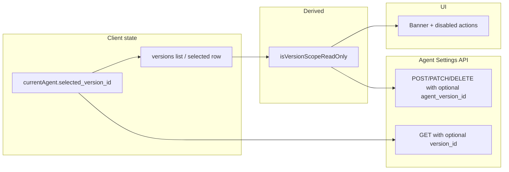

# Version-scoped editing restrictions (published / archived)

## Context from the codebase

- Version metadata already exists: `[IAgentVersionItem.status](apps/operator/src/api/agent-versions.ts)` is `'draft' | 'published' | 'archived'`.
- The selected version is stored on the agent atom as `selected_version_id` via `[useSetSelectedVersionIdAtom](apps/operator/src/atoms/current-agent-atom.ts)`; `[useVersionDropdown](apps/operator/src/components/VersionDropdown/useVersionDropdown.ts)` resolves `selectedVersion` and already encodes related rules (e.g. `isPublishDisabled` when `published` or `archived`).
- **Gap:** Agent-settings data loading for tools/workflows is centralized in `[useGetWorkflowsByScope](apps/operator/src/api/workflows.ts)` → `[useFetchAgentTools](libs/api/src/api/AgentSettings/AgentToolsApi/useAgentToolsApi.ts)`, which currently **does not** pass `version_id`. Task creation already passes `version_id: currentAgent?.selected_version_id` (`[MainContext](apps/operator/src/contexts/MainContext.tsx)`, `[useTaskGeneration](apps/operator/src/widgets/TaskGeneration/useTaskGeneration.ts)`). Until list/mutation calls match the same version context, UI-level locks alone can be wrong or bypassable.

## Recommended model (fits your API contract)

### Confirmed product decision

**Yes — draft first:** To change workflows, tools, parameters, or anything else that **belongs to a version**, the user **must select a draft version** in the dropdown. Selecting **published** or **archived** is for **viewing that version’s snapshot** only; version-scoped editing controls stay disabled (except agent-global surfaces, unchanged).

### Rules

**Rule:** Anything that uses the version-scoped endpoints you listed should be treated as **read-only in the UI** when the **currently selected version** has `status === 'published' || status === 'archived'`. **Draft** remains editable.

**Backend (source of truth):** For the same condition, the API should reject mutating requests (`POST`/`PATCH`/`DELETE` with `agent_version_id`, and view mutations) so the UI cannot be circumvented. Frontend mirrors this for UX.

**API params:** For version-scoped list/mutate calls, pass `version_id` / `agent_version_id` matching `**currentAgent.selected_version_id`** whenever the user is inspecting or editing that version’s bundle (draft **or** published/archived). The contract’s “omit for live entities (default)” applies to **agent-global resources that are not tied to a version row — not as a separate “edit without selecting draft” path for version-scoped data.

**Dropdown default:** The UI often defaults to the **published** “live” row; that implies users land in **read-only** for version-scoped editors until they switch to a **draft**. UX should make that obvious (banner + disabled actions + clear copy), and creation flows should steer users toward **create/select draft** when they need to edit.

## Implementation shape (frontend)

### 1) One derived flag, reused everywhere

Add a small hook (e.g. `useVersionScopedEditLock`) next to existing version UI logic, built from:

- `currentAgent?.selected_version_id`
- `IAgentVersionItem` from the already-fetched versions list (same source as `useVersionDropdown`), or a dedicated `useGetAgentVersion` if you need freshness for a single id.

Export something like:

- `isVersionScopeReadOnly: boolean` — `true` for `published` | `archived`
- `selectedVersion: IAgentVersionItem | null` — for banners and tooling

**Do not** re-scatter `status === 'published' || status === 'archived'` across dozens of files; centralize (you can still re-export a pure helper `isImmutableVersionStatus(status)` for tests).

Optional: combine with existing permission checks (pattern similar to `[canEdit` in ontology-configuration](apps/operator/src/pages/ontology-configuration/useOntologyConfiguration.tsx)): `canMutateVersionScoped = !isVersionScopeReadOnly && can(AGENT_SETTINGS, UPDATE)`.

### 2) Thread version context through the API layer (cause-level, not duct tape)

For each version-scoped surface, extend the shared hooks in `[libs/api` AgentSettings](libs/api/src/api/AgentSettings/) and operator wrappers (`[apps/operator/src/api/workflows.ts](apps/operator/src/api/workflows.ts)`, `[entities.ts](apps/operator/src/api/entities.ts)`, etc.) so that:

- **GET list** calls accept optional `version_id` query (per your table).
- **POST/PATCH/DELETE** bodies include optional `agent_version_id` where specified.

Pass these from **one place** (the new hook or a thin “version context” that reads `currentAgent` + selected version row) into:

- `useFetchAgentTools` params (`/v1/agent-tools?version_id=…`)
- Create/update/delete agent-tool mutations
- Policies, parameters, integrations, scope-entities, card-templates, placeholders, view endpoints, rules, general-settings — as they are wired in operator

Keep **React Query keys** version-aware (`[..., versionIdOrNull]`) so switching the dropdown refetches the correct bundle and does not show stale data.

### 3) UI: gate version-scoped editors, not the whole app

- **In scope (lock when `isVersionScopeReadOnly`):** Base model / tools & workflows, integrations that map to versioned entities, parameters/ontology items that use versioned endpoints, agent-tools rules/settings, etc.
- **Out of scope (leave editable):** Screens that only touch **agent-global** APIs (no `version_id` / `agent_version_id` in contract). Maintain an explicit checklist while rolling out; “global vs version-scoped” should follow **which endpoints the feature uses**, not guesswork.

Concrete UX pattern:

- Persistent **banner** when read-only: “Viewing published/archived version — version-scoped settings can’t be edited.”
- Disable save/create/delete/reorder, close modals that only mutate, and set form controls to read-only where needed.
- Avoid relying solely on “mutation enabled: false” without disabling buttons — users should see _why_ actions are disabled.

### 4) Validation

- Manual: select published → version-scoped lists load with `version_id`; controls disabled; draft → same lists with draft id; editable.
- If backend returns 4xx on illegal mutate, surface a clear toast and **do not** treat as a generic error (optional polish).

## Files likely touched (when implementing)

- New hook/helper: under `[apps/operator/src/hooks/](apps/operator/src/hooks/)` or colocated with `[VersionDropdown](apps/operator/src/components/VersionDropdown/)`.
- `[libs/api/src/api/AgentSettings/AgentToolsApi/useAgentToolsApi.ts](libs/api/src/api/AgentSettings/AgentToolsApi/useAgentToolsApi.ts)` (+ types) for query/body fields.
- `[apps/operator/src/api/workflows.ts](apps/operator/src/api/workflows.ts)` to pass version params from operator into agent-tools fetch/mutations.
- Base model / integrations / entities hooks and major mutating components (incremental rollout per endpoint family).
