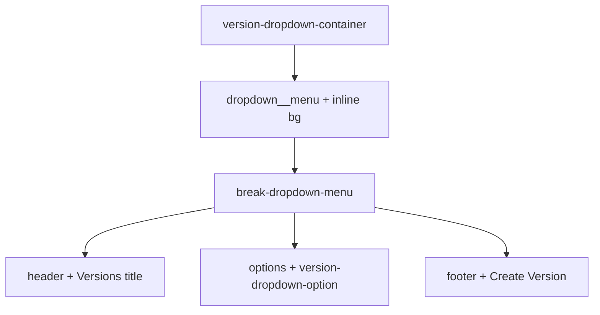

# Dark version picker dropdown menu (`#121212`)

## Context

- The version control lives in `[apps/operator/src/components/VersionDropdown/VersionDropdown.tsx](apps/operator/src/components/VersionDropdown/VersionDropdown.tsx)`: wrapper `**version-dropdown-container**`, `Dropdown` with `className="dropdown version-dropdown"`, `classNamePrefix="dropdown"`, `**withPortal={false}**` (menu stays in the DOM under that wrapper).
- Menu UI is composed of:
  - **React-select** outer node: `.dropdown__menu` (+ custom class `menu` via `classNames`) — gets **inline** `backgroundColor: var(--white)` from `[getStandardMenuStyles](libs/break/src/lib/Dropdown/utils/dropdownUtils.tsx)`.
  - **BreakMenuList** inner shell: `[.break-dropdown-menu](libs/break/src/lib/Dropdown/styles.scss)` with **white** `background`, sticky **header** (`break-dropdown-menu__header` / `__title`), scroll **options** (`break-dropdown-menu__options` + `menu-list`), **footer** (`break-dropdown-menu__footer`) with top border and white background.
- Option rows are already styled in `[apps/operator/src/components/VersionDropdown/styles.scss](apps/operator/src/components/VersionDropdown/styles.scss)` under `**.version-dropdown .menu-list .version-dropdown-option` (dark text + light hover/selected grays) — those values must flip for a dark panel.

## Implementation

**Single file (primary):** extend `[apps/operator/src/components/VersionDropdown/styles.scss](apps/operator/src/components/VersionDropdown/styles.scss)`.

Nest all rules under `**.version-dropdown-container` so no other operator dropdowns change.

| Target                                                                                        | Change                                                                                                                                                                                                                                                 |
| --------------------------------------------------------------------------------------------- | ------------------------------------------------------------------------------------------------------------------------------------------------------------------------------------------------------------------------------------------------------ |
| `.dropdown__menu`                                                                             | `background-color: #121212 !important` (beat inline); optional dark border + shadow consistent with modal dropdown work                                                                                                                                |
| `.break-dropdown-menu`                                                                        | `background: #121212`                                                                                                                                                                                                                                  |
| `.break-dropdown-menu__header`                                                                | Match `#121212` (or same as menu)                                                                                                                                                                                                                      |
| `.break-dropdown-menu__title`                                                                 | Light title color (e.g. `rgba(255,255,255,0.7)` or `#e0e0e0`)                                                                                                                                                                                          |
| `.break-dropdown-menu__options`                                                               | No white strip; optional subtle top separation if needed                                                                                                                                                                                               |
| `.break-dropdown-menu__options [class*="__option"]`                                           | Light base text (Break’s default is `var(--neutral_100)` / dark)                                                                                                                                                                                       |
| Existing `.menu-list .version-dropdown-option` block                                          | Move or duplicate under `.version-dropdown-container`: **label** light, **secondary** muted light; **hover / selected / active** backgrounds as slightly lifted grays (e.g. `rgba(255,255,255,0.06)` / `0.1`) instead of `$neutral_20` / `$neutral_30` |
| `.break-dropdown-menu__footer`                                                                | `background: #121212`, `border-top` `rgba(255,255,255,0.08)`                                                                                                                                                                                           |
| Footer action (`.custom-dropdown-button`, `.break-dropdown-menu__footer-action-label`, hover) | Light text/icons; hover background `rgba(255,255,255,0.08)` (override Break’s `$neutral_20` hover)                                                                                                                                                     |
| `.version-dropdown-option__edit-button`                                                       | Ensure pencil is visible (e.g. icon stroke / button hover scoped under container)                                                                                                                                                                      |

**Optional TSX tweak:** in `[VersionDropdown.tsx](apps/operator/src/components/VersionDropdown/VersionDropdown.tsx)`, extend `classNames.menu` to add a dedicated class (e.g. `version-dropdown__menu`) so the outer menu hook is explicit; not required if `.version-dropdown-container .dropdown__menu` is unique enough.

**Out of scope:** changing `[libs/break/src/lib/Dropdown/styles.scss](libs/break/src/lib/Dropdown/styles.scss)` globally; Chips (`gray` / `success`) likely remain acceptable on dark—only add overrides if contrast fails in QA.

## Verification

- Open header version menu: panel `#121212`, “Versions” readable, list items and Draft/Live chips legible, selected/hover states visible, footer “Create Version” readable, edit icon on hover visible.
