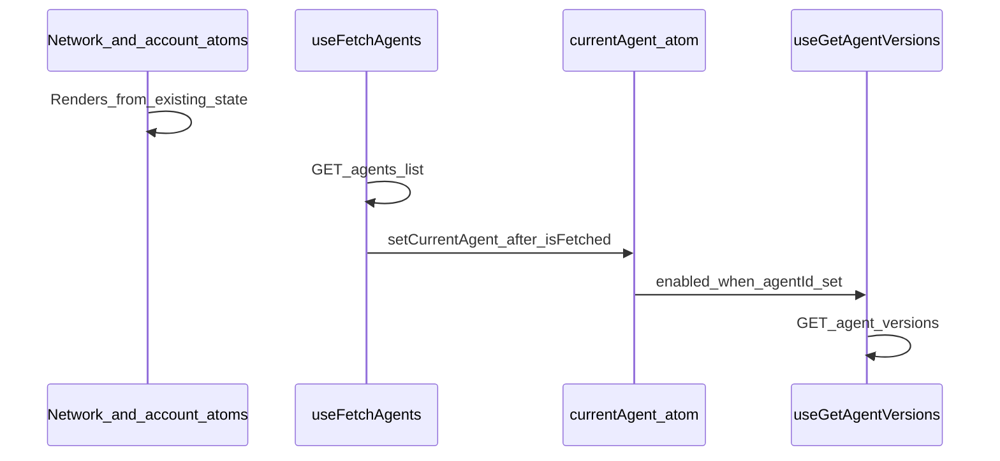

# Why the header versions load later (and how to fix)

## What is happening

### 1. The version block is gated on more than the network

In `[apps/operator/src/widgets/Header/Header.tsx](apps/operator/src/widgets/Header/Header.tsx)`, the versions UI (separator + `VersionDropdown`) only renders when **all** of these are true:

- ConfigCat flag `AGENT_VERSIONING` is on (`useConfigCatFlag('AGENT_VERSIONING')`).
- User is not AUI mode admin.
- `**currentAgent` is truthy (from Jotai via `useCurrentAgentValueAtom()`).

Org / account / network controls read from other atoms and URL-driven setup; they do **not** wait for `currentAgent`.

### 2. `currentAgent` is filled only after the agents list request completes

`[apps/operator/src/hooks/useCurrentAgent.ts](apps/operator/src/hooks/useCurrentAgent.ts)` uses `useFetchAgents` for `selectedNetworkId`. Only after `isFetched` does a `useEffect` run `resolveAgentFromList(agents)` and `**setCurrentAgent(resolvedAgent)`. So the version strip cannot appear until that first agents request has finished and the effect has run.

### 3. Second network round-trip: versions list

`[apps/operator/src/components/VersionDropdown/useVersionDropdown.ts](apps/operator/src/components/VersionDropdown/useVersionDropdown.ts)` calls `useGetAgentVersions` with:

```65:68:apps/operator/src/components/VersionDropdown/useVersionDropdown.ts
  const { data: versionsResponse, isPending } = useGetAgentVersions({
    agentId: currentAgent?.id || '',
    enabled: !!currentAgent?.id,
  });
```

That maps to GET `/v1/agents/{agentId}/versions` in `[apps/operator/src/api/agent-versions.ts](apps/operator/src/api/agent-versions.ts)`. This query is `**enabled` only when `currentAgent.id` exists**, so it starts **after** step 2—not in parallel with the agents list. That is the main **waterfall.

### 4. Perceived “still loading” while the dropdown is disabled

`[apps/operator/src/components/VersionDropdown/VersionDropdown.tsx](apps/operator/src/components/VersionDropdown/VersionDropdown.tsx)` passes `isDisabled={isPending}` to the `Dropdown`. Until the versions query resolves, the control stays disabled even though the branch icon and “Versions” label may already render (via `[VersionCustomControl.tsx](apps/operator/src/components/VersionDropdown/partial/VersionCustomControl.tsx)`).

### 5. Optional contributor: ConfigCat

`[AGENT_VERSIONING](apps/operator/src/feature-flags/configCatFlags.ts)` defaults to `**false`**. If ConfigCat is enabled and the remote value is `true`, the flag value updates after the SDK loads; the header does not use the flag’s `loading` state, so the versions block can **pop in after other header chrome. This is a smaller effect than the agents → versions waterfall but worth noting if you see the entire version segment appear late with no intermediate `currentAgent` delay.

---

## Data flow (mermaid)



---

## Recommended fix (cause, not symptom)

**Prefetch agent versions as soon as the resolved agent id is known from the agents list**, in the same place that already owns agent resolution: `[useCurrentAgent](apps/operator/src/hooks/useCurrentAgent.ts)`.

- When `agents` + `isFetched` + `selectedNetworkId` allow computing `resolveAgentFromList(agents)`, call `queryClient.prefetchQuery` (or `ensureQueryData`) with a **query key and queryFn identical** to `[useGetAgentVersions](apps/operator/src/api/agent-versions.ts)`: `[AGENT_VERSIONS_QUERY_KEY, agentId, params]` where `params` is `undefined` for the default list call, and the same URL/params/instance/mapper as the hook.

This overlaps the versions request with the gap between “agents response ready” and “VersionDropdown mounted + useQuery subscribed,” so by the time the header enables the dropdown, React Query often already has cached data—`isPending` drops quickly and the control no longer lags the rest of the bar.

**Implementation details to get right:**

- Extract a small shared helper in `[agent-versions.ts](apps/operator/src/api/agent-versions.ts)` (e.g. `getAgentVersionsQueryOptions(agentId, params?)`) that returns `{ queryKey, queryFn }` used by both `useGetAgentVersions` and prefetch, so keys and normalization **cannot drift**.
- Guard prefetch: only when `resolvedAgent?.id` and `selectedNetworkId` are set (and optionally when you want to avoid work when versioning is off—either always prefetch, which is a minor extra request when versioning is disabled, or pass a flag / read ConfigCat in layout—product tradeoff).

**Validate** by reloading the dashboard with network throttling: versions should track much closer to the agents list completion instead of one full RTT later.

---

## Optional UX polish (only if needed after prefetch)

- Reserve horizontal space or show a lightweight skeleton for the version slot when `currentAgent` is still null to reduce layout shift (the separator currently appears with the whole block).
- If ConfigCat latency is noticeable, consider using the flag’s `loading` state in the header to avoid a late mount flash (without changing defaults blindly).

---

## Files likely touched

- `[apps/operator/src/hooks/useCurrentAgent.ts](apps/operator/src/hooks/useCurrentAgent.ts)` — trigger prefetch when resolved agent id is known.
- `[apps/operator/src/api/agent-versions.ts](apps/operator/src/api/agent-versions.ts)` — shared query options for hook + prefetch (DRY).

No change strictly required to `[VersionDropdown.tsx](apps/operator/src/components/VersionDropdown/VersionDropdown.tsx)` if prefetch fixes latency; `isDisabled={isPending}` remains correct.
