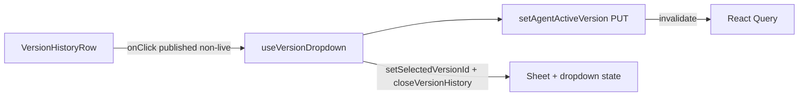

# Version history Revert button (Operator / Apollo theme)

## Context

- `[VersionHistoryRow.tsx](apps/operator/src/components/VersionDropdown/partial/VersionHistoryRow.tsx)` renders each row with `__main` (title, tags, chip, subline) and a trailing `Menu` (kebab). Layout is flex in `[styles.scss](apps/operator/src/components/VersionDropdown/styles.scss)` (`.version-history-row`).
- **Activation API already exists**: `[useVersionDropdown.ts](apps/operator/src/components/VersionDropdown/useVersionDropdown.ts)` calls `setAgentActiveVersion` from `@aui/api` with `{ urlParams: { id: currentAgent.id }, active_version_id: versionId }` after publish when the published id differs from `active_version_id` (see `handlePublishVersionConfirm`, ~lines 415–432). The same PUT `[/v1/agents/{id}/active-version](libs/api/src/api/AgentSettings/AgentsApi/useAgentsApi.ts)` is the correct “activate / revert live version” operation for an already-published version.
- **Published vs live**: `[isAgentVersionLive](apps/operator/src/components/VersionDropdown/versionDropdownFormat.ts)` is true when the version is `published` **and** `version.id === activeVersionId` (this is the currently activated / live deployment).

## Visibility rules (required)

- **Show Revert** only when `version.status === 'published'` **and** the version is **not** the active one (`!isAgentVersionLive(version, activeVersionId)`).
- **Do not show** Revert for the **already activated** (live) version — no disabled state; the control is omitted entirely for that row.
- Draft / archived rows: no Revert (only published, non-live).

## Implementation

### 1. `useVersionDropdown.ts`

- Add `handleRevertToPublishedVersion(version: IAgentVersionItem)` with:
  - Early return if `!currentAgent?.id` or `version.status !== 'published'`.
  - Early return if `isAgentVersionLive(version, currentAgent.active_version_id)` (already live).
  - Track in-flight target id with local state (e.g. `revertInFlightVersionId: string | null`) set before `await setAgentActiveVersion(...)` and cleared in `finally`, so the clicked row can show loading and double-clicks are avoided.
  - On success: invalidate `[AGENT_VERSIONS_QUERY_KEY, currentAgent.id]` and `['current-agent']` (same as publish path), `setSelectedVersionId(version.id)`, `toast.success(...)` (e.g. “Live version updated” or “Reverted to …”), `closeVersionHistory()` so behavior matches other history actions that close the sheet after opening a modal (here: close after successful revert).
  - On error: reuse the same toast pattern as publish (`Failed to activate version` or API message).
- Export: `handleRevertToPublishedVersion`, `revertInFlightVersionId` (or a boolean + id—whatever is minimal for the row).

### 2. `VersionDropdown.tsx`

- Destructure the new handler and in-flight id from `useVersionDropdown()` and pass them into `VersionHistoryPanel`.

### 3. `VersionHistoryPanel.tsx`

- Extend props with `onRevertToPublishedVersion: (version: IAgentVersionItem) => void` and `revertInFlightVersionId: string | null` (names can match the hook).
- Forward to each `VersionHistoryRow`.

### 4. `VersionHistoryRow.tsx`

- Import `IconArrowRotateCounterClockwise` from `central-icons` (same icon family as other “Revert/Undo” usage in the operator app, e.g. widgets builder action buttons).
- Import `Button` from `@aui/break` (or native `button` + BEM if you prefer zero kit coupling; `Button` is consistent with the rest of Break usage here).
- Render Revert **only when** `version.status === 'published' && !isAgentVersionLive(version, activeVersionId)` so the **currently activated version never shows Revert** (import `isAgentVersionLive` from `[versionDropdownFormat.ts](apps/operator/src/components/VersionDropdown/versionDropdownFormat.ts)`). Do not use a disabled Revert for the live row — omit the button.
- Place the control in a small wrapper (e.g. `.version-history-row__actions`) **between** `__main` and the `Menu`, using flex so the kebab stays right-aligned; vertically align the actions column with the row (adjust `.version-history-row` from `align-items: flex-start` to `center` if needed so the button matches the design’s vertical centering without breaking multi-line titles—verify in SCSS).

### 5. `[styles.scss](apps/operator/src/components/VersionDropdown/styles.scss)` (Apollo / light)

- Add `.version-history-row__revert` (and optional `__actions`) using existing tokens already used in this file (`$neutral_`, `var(--neutral_20)`, etc.) and **Operator secondary accent** from `[variables_v2.scss](libs/break/src/styles/variables_v2.scss)` (`$secondary` — “Secondary (Purple - Operator project)”) for label + icon treatment, analogous to the lavender accent in the mock but aligned with the app palette.
- Use `CentralIcon` with `IconColor.Interactive` or a purple-aligned token that matches sidebar/operator accents (see `[iconConfigs.ts](libs/break/src/lib/Icon/iconConfigs.ts)` — e.g. `Interactive` / `AlternativePurple`); keep border/background subtle like the reference (border + light fill), not a primary solid CTA.

### 6. Scope / parity

- Default export `[VersionDropdown/index.ts](apps/operator/src/components/VersionDropdown/index.ts)` points at the main `[VersionDropdown.tsx](apps/operator/src/components/VersionDropdown/VersionDropdown.tsx)` (used from `[Header.tsx](apps/operator/src/widgets/Header/Header.tsx)`). **No change required** under `dark-new/` unless you explicitly want feature parity there later.

## Testing

- Run `nx lint operator` (and a quick manual check: open Version History, confirm Revert appears only on published non-live rows, **the live row has no Revert**, click triggers API success path and sheet closes).

## Mermaid (data flow)

