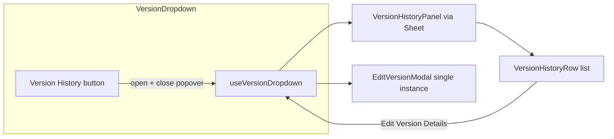

# Version History overlay panel

## Context (current code)

- [VersionDropdown.tsx](apps/operator/src/components/VersionDropdown/VersionDropdown.tsx) wires **Version History** to `noopVersionHistory` (lines 128–137). This becomes `setMenuOpen(false)` + open panel.
- Data and mutations already live in [useVersionDropdown.ts](apps/operator/src/components/VersionDropdown/useVersionDropdown.ts) via `useGetAgentVersions` and `handleOpenEditVersionModal(version)` ([agent-versions.ts](apps/operator/src/api/agent-versions.ts) defines `IAgentVersionItem` with `created_at`, `published_at`, `status`, `label`, `tags`, version numbers).
- [VersionActionsButton.tsx](apps/operator/src/components/VersionDropdown/partial/VersionActionsButton.tsx) is the single place that defines the action menu + hosts `EditVersionModal`. Row-level menus must **not** duplicate that modal; they should call the same `handleOpenEditVersionModal` for the row’s `version`.

## UI / layout (match design + “no squish”)

### Use `Sheet` from `@aui/break` (preferred)

- `**Sheet`** lives in [libs/break/src/lib/Sheet/Sheet.tsx](libs/break/src/lib/Sheet/Sheet.tsx), uses the same `**react-modal`** stack, overlay blur, and **slot pattern** as `Modal` (`Sheet.Title`, `Sheet.Description`, `Sheet.Content`, `Sheet.Footer`as **direct children of`Sheet`).
- **Exports** (from `@aui/break`): `Sheet`, `SheetHeader`, `SheetClose` — see [libs/break/src/index.ts](libs/break/src/index.ts).
- **Version History panel props** (align with stories / Modal parity):
  - `isOpen` + `onRequestClose` (backdrop + Escape, same as Modal).
  - `side="right"` (default is already `right` in API if omitted — set explicitly for clarity).
  - `withCloseIcon` / `withPadding` / `showTitleSeparator={false}` as needed.
  - `**SheetClose`: must render under `<Sheet>` (context); use in header/footer for the X; optional `aria-label="Close"`.
  - `**SheetHeader`: optional layout wrapper (`break-sheet__header`); use inside `Sheet.Content` if the design needs a grouped header block (icon + title + close) beyond `Sheet.Title` alone.
- **No squish**: overlay + right-docked panel are handled inside Sheet ([styles.scss](libs/break/src/lib/Sheet/styles.scss)); main layout is not resized.
- **Stacking**: default sheet overlay `**z-index: 1002`** ([styles.scss](libs/break/src/lib/Sheet/styles.scss)); version `Popover` uses `**1003`**. Flow already **closes the popover** when opening history — acceptable. If product ever needs the sheet **above an open popover, add a targeted operator override (e.g. `.version-history-sheet` on overlay) — only if required.
- **Dark theme**: Sheet default surface is light (`$white`); add **operator SCSS** (e.g. `.version-history-sheet` / `className` on `Sheet`) to match `.version-popover-panel` / `version-dropdown-modal` dark treatment, reusing tokens from [variables_v2.scss](libs/break/src/styles/variables_v2.scss) where possible.

## Panel structure (per mock)

1. **Header**: history icon + “Version History” title + close button (e.g. `IconCrossMedium` / existing break `Button` patterns).
2. **Toolbar row**: search field (magnifier + placeholder “Search…”) and a **status filter** control showing “All” by default.
3. **Scrollable list**: one row per version with:

- **Title**: `getVersionDisplayLabel(version)` (same idea as [useVersionDropdown.ts](apps/operator/src/components/VersionDropdown/useVersionDropdown.ts) `getVersionDisplayLabel` / `getVersionNumberLabel`).
- **Version tag badge**: e.g. `V{n}` or `V{n}.{rev}` (design shows “V2”; align with existing numbering helpers).
- **Status**: `published` → “Live” (green chip), `archived` → “Archived” (gray + archive icon if desired), `draft` → “Draft” (gray) — same mapping as `getStatusConfig` in the hook today.
- **Subline** (metadata from endpoint fields):
  - **Live**: `Live since {published_at} • {duration}` using `moment` (already used across operator).
  - **Non-live with a meaningful window**: prefer **derived** range when possible: if `published_at` exists, treat **end** as the **next later `published_at` among other versions** on the same agent (sorted), else fall back to “now” for the current live successor narrative; **duration** = that interval. If a version never had `published_at` (draft), show **Created {created_at} • {duration since created}** (or equivalent short copy). Document in code that **exact “archived on”** is not in `IAgentVersionItem` today — this derivation is the accurate approach given the schema, not a UI-only fake date.
- **Trailing actions**: `Menu` from `@aui/break` with `triggerVariant="unstyled"` and an **icon-only** label (vertical dots), `menuClassName="version-actions-menu"` so styling matches the header actions menu.

## Search and status filter

- **Search**: client-side filter over the in-memory `versions` list (max page size 100 today): match `label`, stringified version/revision, and joined `tags`. Keeps one network response and instant filtering.
- **Status filter**: client-side slice by `TAgentVersionStatus` with options **All**, **Live** (`published`), **Archived**, **Draft** (design emphasizes Live/Archived; Draft included because the API supports it and the dropdown already surfaces drafts).
- Optional follow-up (not required for MVP): pass `params.status` into `useGetAgentVersions` if product later needs server-side filtering for paginated large histories — the hook already accepts `params` and includes it in the query key.

## State and hook changes

- Extend [useVersionDropdown.ts](apps/operator/src/components/VersionDropdown/useVersionDropdown.ts) with:
  - `isVersionHistoryOpen` / `openVersionHistory` / `closeVersionHistory`
  - `versionHistorySearch`, `setVersionHistorySearch`
  - `versionHistoryStatusFilter: 'all' | TAgentVersionStatus` (or enum-like union)
  - `filteredVersionsForHistory` via `useMemo` from `sortedVersions` (or a dedicated chronological sort for the panel if product wants strict “newest first” by `created_at` — call out **sort order** explicitly in implementation: likely `created_at` desc to match API default).
- Reset panel UI state when `currentAgent?.id` changes (same `useEffect` that already resets modals/menus).

## Reuse VersionActionsButton behavior (DRY)

- Extract shared menu content from [VersionActionsButton.tsx](apps/operator/src/components/VersionDropdown/partial/VersionActionsButton.tsx) into a small partial, e.g. `VersionActionMenuItems.tsx`, that renders the same `MenuItem` blocks and accepts `onOpenEditVersionDetails: () => void` (callers close over the target version).
- Refactor `VersionActionsButton` to render `Menu` + `VersionActionMenuItems` + `EditVersionModal` (unchanged props).
- [VersionDropdown.tsx](apps/operator/src/components/VersionDropdown/VersionDropdown.tsx): render **one** `EditVersionModal` at the top level **or** keep it inside `VersionActionsButton` only — **recommended**: lift `EditVersionModal` next to `CreateVersionModal` in `VersionDropdown` and pass props from the hook so **both** the header actions menu and history rows share the same modal instance (avoids N duplicate modals if N rows). `VersionActionsButton` then becomes trigger + menu items only, or accepts `renderModal={false}` — pick the smallest diff that leaves a single modal mount.

## Files to touch (expected)

- [apps/operator/src/components/VersionDropdown/VersionDropdown.tsx](apps/operator/src/components/VersionDropdown/VersionDropdown.tsx) — wire button, render panel, consolidate modal placement if lifted.
- [apps/operator/src/components/VersionDropdown/useVersionDropdown.ts](apps/operator/src/components/VersionDropdown/useVersionDropdown.ts) — panel state + filtered list + metadata helpers.
- [apps/operator/src/components/VersionDropdown/styles.scss](apps/operator/src/components/VersionDropdown/styles.scss) — dark theme overrides for Sheet (scoped class on `Sheet` + `.break-sheet` / overlay descendants as needed).
- New partials under `apps/operator/src/components/VersionDropdown/partial/`:
  - `VersionHistoryPanel.tsx` (presentation; thin, uses hook outputs)
  - `VersionHistoryRow.tsx` (row + dots menu)
  - `VersionActionMenuItems.tsx` (shared items; refactor from `VersionActionsButton`)

## Validation

- Run `nx lint operator` (and `nx build operator` if time) after implementation.

