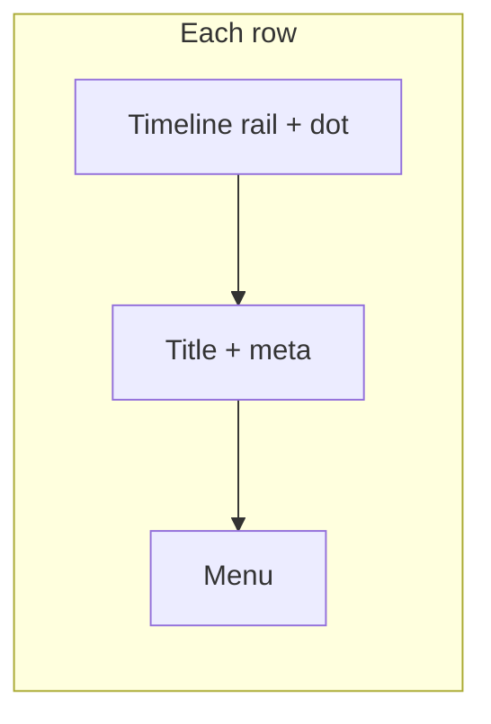

# Version history timeline bar and live dot

## Context

- Rows are rendered by `[VersionHistoryRow](apps/operator/src/components/VersionDropdown/partial/VersionHistoryRow.tsx)` inside `[VersionHistoryPanel](apps/operator/src/components/VersionDropdown/partial/VersionHistoryPanel.tsx)` list items (`version-history-panel__list-item` / `version-history-sheet__list-item` in dark-new).
- “Live” is already defined in `[versionDropdownFormat.ts](apps/operator/src/components/VersionDropdown/versionDropdownFormat.ts)` via `isAgentVersionLive(version, activeVersionId)` (published + matches `active_version_id`).
- Styling lives in `[styles.scss](apps/operator/src/components/VersionDropdown/styles.scss)` (light) and `[dark-new/styles.scss](apps/operator/src/components/VersionDropdown/dark-new/styles.scss)` (dark). SCSS variables like `$primary` / neutrals are available through the operator global style pipeline (same as existing `$neutral_*` usage in these files).

## UI behavior

- **Vertical bar**: A continuous-looking line along the list, implemented **per row** with a rail column and a centered `::before` (or similar) segment, clipped on first/last list items so the line starts at the first dot and ends at the last dot.
- **Dots**: One per row, horizontally centered on the rail, vertically aligned with the **first line of the title** (fixed offset from the top of the row, tuned to match current title typography/padding).
- **Live dot**: When `isAgentVersionLive` is true, add a modifier class (e.g. `version-history-row--live`) on the row root and style the dot with `**$primary`** fill and a **soft glow via `box-shadow` (and optionally a subtle ring using `$primary-light` / rgba for the halo).

## Implementation steps

1. `**[partial/VersionHistoryRow.tsx](apps/operator/src/components/VersionDropdown/partial/VersionHistoryRow.tsx)`

- Import `isAgentVersionLive` (already imported).
- Compute `const isLive = isAgentVersionLive(version, activeVersionId)`.
- Set root class: `classNames('version-history-row', { 'version-history-row--live': isLive })`.
- Insert a **first child** column before `version-history-row__main`:
  - Wrapper e.g. `version-history-row__timeline` with `aria-hidden="true"` (decorative).
  - Inner `span.version-history-row__dot` (or dot as pseudo-element on the rail — either works; a real element is easier for live-specific styling).
- Keep existing flex layout: timeline (fixed width) + main (flex 1) + actions.

1. `**[dark-new/partial/VersionHistoryRow.tsx](apps/operator/src/components/VersionDropdown/dark-new/partial/VersionHistoryRow.tsx)`

- Mirror the same structure and classes.
- Import and use `isAgentVersionLive` for `isLive` (dark-new already receives `activeVersionId`).

1. `**[styles.scss](apps/operator/src/components/VersionDropdown/styles.scss)` (version history block)

- `.version-history-row`: ensure `display: flex`; `align-items: stretch` (or `flex-start` with stretch on timeline); add left spacing so content does not collide with the rail.
- `.version-history-row__timeline`: `position: relative`; fixed width (~20–24px); flex-shrink 0; `align-self: stretch`.
- Vertical connector: `::before` on the timeline (or on the row scoped to list-item) with `background` using a neutral token (e.g. `$neutral_40` / `var(--neutral_40)` — match existing borders in this file).
- Clip segments using list context:
  - `.version-history-panel__list-item:first-child .version-history-row__timeline::before` — raise `top` so the line starts at the dot center.
  - `.version-history-panel__list-item:last-child` — lower `bottom` so the line ends at the dot center.
  - Optional: `.version-history-panel__list-item:only-child` — hide or shorten connector if a single row should be dot-only (product choice; default can keep a short segment).
- `.version-history-row__dot`: small circle (~8px), centered on the rail x-axis; `position: absolute`; `top` tuned to align with the title row (iterate visually).
- `.version-history-row--live .version-history-row__dot`: `background-color: $primary`; `box-shadow` glow using `$primary` / `$primary-light` (no new hex literals if variables cover it).
- Adjust `.version-history-panel__list` horizontal padding if the rail needs more room without clipping.

1. `**[dark-new/styles.scss](apps/operator/src/components/VersionDropdown/dark-new/styles.scss)`

- Duplicate the same timeline/dot/connector rules for `.version-history-row` under the dark sheet, using existing dark neutrals (e.g. `rgba(255,255,255,0.12)` for the line) and the **same primary + glow** for live so the live state stays recognizable on dark surfaces.
- Use `.version-history-sheet__list-item:first-child` / `:last-child` for clipping (parallel to light).

1. **Validation**

- Multiple versions: line reads as one continuous rail; dots sit at title height.
- One version: connector still looks acceptable (or only-child rule applied if you choose that polish).
- Live version: dot clearly glows primary; non-live dots remain neutral.
- No a11y regression: timeline marked decorative; live status remains in the chip + copy.

## Files to touch

| File                                                                                                                            | Change                                    |
| ------------------------------------------------------------------------------------------------------------------------------- | ----------------------------------------- |
| `[partial/VersionHistoryRow.tsx](apps/operator/src/components/VersionDropdown/partial/VersionHistoryRow.tsx)`                   | Timeline markup + `--live` modifier       |
| `[dark-new/partial/VersionHistoryRow.tsx](apps/operator/src/components/VersionDropdown/dark-new/partial/VersionHistoryRow.tsx)` | Same                                      |
| `[styles.scss](apps/operator/src/components/VersionDropdown/styles.scss)`                                                       | Timeline, dot, live glow, list-item clips |
| `[dark-new/styles.scss](apps/operator/src/components/VersionDropdown/dark-new/styles.scss)`                                     | Dark theme equivalents                    |

No changes to `VersionHistoryPanel` are strictly required unless you prefer passing `isFirst`/`isLast` from the map for simpler clipping; CSS on `list-item` is enough.
