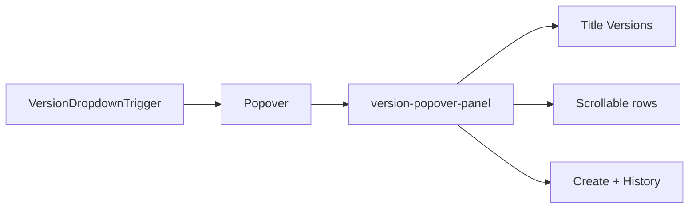

# Version dropdown: Popover + custom panel

## Why change

- Stops relying on react-select + `getStandardMenuStyles()` inline styles (no more `!important` war on options).
- Panel markup and SCSS are fully under operator control to match the reference (charcoal shell ~`#121212`/`#1a1a1a`, selected row ~`#2A2A2A`, footer separator, pin + Live chip layout).

## Critical hook fix (portal)

`[useVersionDropdown.ts](apps/operator/src/components/VersionDropdown/useVersionDropdown.ts)` registers a **document `click`** handler that calls `setMenuOpen(false)` when the target is **not** inside `wrapperRef` (lines ~454–466). The popover **floating content is rendered in `FloatingPortal` outside** `[version-dropdown-container](apps/operator/src/components/VersionDropdown/VersionDropdown.tsx)`, so clicks on version rows/footer would be treated as “outside” and break the menu.

**Action:** Remove that `useEffect` + `handleClickOutside` (and only that). Rely on `[Popover](libs/break/src/lib/Popover/Popover.tsx)` `useDismiss` (`outsidePress`) to close on outside click. Keep `wrapperRef` on the header strip for any future use (e.g. scroll), but do not use it for global click-out with a portaled panel.

## UI structure

1. **Trigger**

- Replace `[CustomControl.tsx](apps/operator/src/components/VersionDropdown/partial/CustomControl.tsx)` (react-select–only) with a `**VersionDropdownTrigger`: `Button` `variant="unstyled"`, same classes as today (`version-dropdown-control`), shows `selectedVersionValue?.label ?? 'Versions'` + chevron.
- Must be a **single element** Popover can `cloneElement` (see Popover warning); use `**forwardRef` on the trigger so Floating UI’s `refs.setReference` attaches (match Break `Button` ref behavior).

1. **Popover** (from `@aui/break`)

- Controlled: `open={menuOpen}`, `setOpen={setMenuOpen}` (Floating UI passes boolean).
- `placement="bottom-start"`, `offsetValue` ~8, `zIndex` ~**1003** (aligned with operator `[CustomPopover](apps/operator/src/pages/base-model/partials/Mapping/partials/CustomPopover/CustomPopover.tsx)`).
- Consider `closeOnScroll={true}` if the header scroll should dismiss the panel (product choice; default can match mapping popover).

1. **Panel children** (new wrapper + classes, e.g. `version-popover-panel`)

- **Header:** static title `Versions` (same copy as `menuTitle` today).
- **Body:** `overflow-y: auto`, `max-height` tuned (similar to previous menu cap, e.g. ~min(60vh, N px) or match existing visual). Map `[versionOptions](apps/operator/src/components/VersionDropdown/useVersionDropdown.ts)` to rows.
- **Row:** Extract presentational markup from `[CustomOption.tsx](apps/operator/src/components/VersionDropdown/partial/CustomOption.tsx)` into something like `**VersionListRow`**: props `{ option: IVersionDropdownOption, isSelected, onSelect }`. Use `<button type="button">` (or `role="option"` inside `role="listbox"` on the list) for a11y; **remove `react-select` `components.Option`.
- **Empty state:** if `versionOptions.length === 0`, show “No versions found” in the scroll area.
- **Footer:** same two actions as today (`[VersionDropdown.tsx](apps/operator/src/components/VersionDropdown/VersionDropdown.tsx)` lines ~80–101): Create Version (`handleOpenCreateVersionModal`), Version History (noop + comment).

1. **Selection**

- On row click: `setSelectedVersionId(option.value)` + `setMenuOpen(false)` (same as current `[handleSelectChange](apps/operator/src/components/VersionDropdown/useVersionDropdown.ts)`). Optionally add `selectVersionById` in the hook; not required if inline is clear.

## `[VersionDropdown.tsx](apps/operator/src/components/VersionDropdown/VersionDropdown.tsx)`

- Remove `Dropdown`, `OptionProps`, `react-select` imports.
- Import `Popover` from `@aui/break`.
- Structure: `wrapperRef` flex row unchanged; **Popover** wraps **trigger + panel** (trigger as `trigger` prop, panel as `children`).
- Pass `isDisabled={isLoading}` behavior: when loading, avoid opening (guard in `setOpen` or disable trigger `Button` and no-op open).

## SCSS (`[styles.scss](apps/operator/src/components/VersionDropdown/styles.scss)`)

- Add `**.version-popover-panel` (and BEM children: `__header`, `__title`, `__list`, `__row`, `__row--selected`, `__footer`, etc.) with tokens aligned to existing dark menus (`#1a1a1a` / `#121212`, border `rgba(255,255,255,0.12)`, selected row `#2a2a2a` or `rgba(255,255,255,0.12)`). Reuse chip tweaks if rows still use `Chip`.
- **Delete or heavily trim** the version-only overrides that targeted `.dropdown__menu`, `.break-dropdown-menu__options`, react-select option classes, and the `!important` option overrides under `.version-dropdown-container` (no longer needed).
- **Keep** `.version-dropdown-control` and `[VersionActionsButton](apps/operator/src/components/VersionDropdown/partial/VersionActionsButton.tsx)` / modal blocks as-is unless a small trigger tweak is needed.

## Files to touch

| File                                                                                                                                                                                      | Change                                                               |
| ----------------------------------------------------------------------------------------------------------------------------------------------------------------------------------------- | -------------------------------------------------------------------- |
| `[useVersionDropdown.ts](apps/operator/src/components/VersionDropdown/useVersionDropdown.ts)`                                                                                             | Remove document click-outside effect.                                |
| `[VersionDropdown.tsx](apps/operator/src/components/VersionDropdown/VersionDropdown.tsx)`                                                                                                 | Popover + panel composition; drop Dropdown.                          |
| New: `partial/VersionDropdownTrigger.tsx` (or rename `CustomControl`)                                                                                                                     | forwardRef trigger.                                                  |
| New: `partial/VersionListRow.tsx` + keep `[IVersionDropdownOption](apps/operator/src/components/VersionDropdown/partial/CustomOption.tsx)` (move type to row file or shared `interfaces`) | Drop react-select from option UI; delete or slim `CustomOption.tsx`. |
| `[styles.scss](apps/operator/src/components/VersionDropdown/styles.scss)`                                                                                                                 | New panel theme; remove obsolete react-select/break-menu overrides.  |

## Verification

- Open menu: rows select version and close; Create Version opens modal and closes menu; outside click closes menu; **clicks inside panel do not instantly close** (regression test for portal + removed listener).
- `npx eslint` on changed TSX/TS files.
