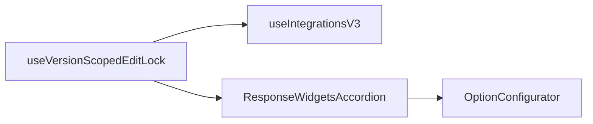

# Version-scoped read-only: Integrations V3 and widget configuration

## How agent-tools already does it

- Central hook: `[apps/operator/src/hooks/useVersionScopedEditLock.ts](apps/operator/src/hooks/useVersionScopedEditLock.ts)` — when ConfigCat `AGENT_VERSIONING` is on and the selected version’s status is `published` or `archived`, `isSelectedAgentVersionReadOnly` is `true`.
- Tools list: `[apps/operator/src/pages/base-model/hooks/useWorkflowList.ts](apps/operator/src/pages/base-model/hooks/useWorkflowList.ts)` guards create/delete/native-tool flows with that flag and shows a toast (e.g. “Select a draft version…”).
- UI affordances: `[apps/operator/src/pages/base-model/BaseModel.tsx](apps/operator/src/pages/base-model/BaseModel.tsx)` disables “Create tool” when read-only and shows `[VersionScopedReadOnlyBanner](apps/operator/src/pages/base-model/partials/VersionScopedReadOnlyBanner/VersionScopedReadOnlyBanner.tsx)` on several tabs.

**Gap (in scope):** The Integrations V3 tab already renders the banner but `[useIntegrationsV3.ts](apps/operator/src/pages/IntegrationsV3/useIntegrationsV3.ts)` does not use the lock — all create/update/delete/enrichment/RAG-related mutations can still run while viewing a snapshot version.

**Out of scope for now:** The Widgets Builder tab (banner + `[useWidgetsBuilder.ts](apps/operator/src/pages/widgets-builder/useWidgetsBuilder.ts)` mutation guards) — can be a follow-up if product wants the same read-only rules there later.

**About `[widgets.ts](apps/operator/src/components/CardConfigurator/widgets/widgets.ts)`:** This file is a static registry (widget definitions, icons). Read-only behavior belongs in hooks/components that perform mutations or open editors — not in `widgets.ts`. The user-facing “modify widgets” path for **tools** is `[ResponseWidgetsAccordion](apps/operator/src/pages/base-model/partials/ResponseRules/ResponseWidgetsAccordion.tsx)` + `[OptionConfigurator](apps/operator/src/components/CardConfigurator/OptionConfigurator.tsx)` (which already supports a `disabled` prop on the “Configure Widget” button but does not tie it to version read-only, and does not disable other controls on that accordion).

---

## 1. Integrations V3

**Hook** — In `[useIntegrationsV3.ts](apps/operator/src/pages/IntegrationsV3/useIntegrationsV3.ts)`:

- Call `useVersionScopedEditLock()` (same import path as other features: `@operator/hooks/useVersionScopedEditLock`).
- Expose `isSelectedAgentVersionReadOnly` on the returned object (e.g. under `ui`).
- At the **start** of every mutating handler (`handleCreateRag`, `handleCreateApi`, `handleSaveApiEdit`, `handleSaveDescription`, `handleConfirmDelete`, `handleSaveSettings`, enrichment create/save/delete, etc.), if `isSelectedAgentVersionReadOnly`, show `toast.error` with wording consistent with workflows (draft required) and **return** without calling the API. This matches the “cause” pattern used in `useWorkflowList` rather than only hiding buttons.

**UI** — In `[IntegrationsV3.tsx](apps/operator/src/pages/IntegrationsV3/IntegrationsV3.tsx)` and `[IntegrationsV3Table.tsx](apps/operator/src/pages/IntegrationsV3/components/IntegrationsV3Table.tsx)`:

- Pass `readOnly={isSelectedAgentVersionReadOnly}` (or equivalent) into the table.
- Disable “New Integrations”, row action menus (edit, description, delete, settings, enrichment actions), and row-click handlers that open edit modals when `readOnly` is true. Keep non-destructive UX where it already exists (e.g. expand/collapse, search) unless product wants those disabled too.

This covers both Base Model’s Integrations tab and the standalone `[ERoutes.INTEGRATIONS_V3](apps/operator/src/constants.ts)` route: when versioning is off or no agent context, the hook returns `false` for read-only.

---

## 2. Tool response widgets (CardConfigurator / `widgets.ts` usage)

**Do not edit `widgets.ts`** for read-only; wire version lock where the UI mutates workflow/widget config.

`**[ResponseWidgetsAccordion.tsx](apps/operator/src/pages/base-model/partials/ResponseRules/ResponseWidgetsAccordion.tsx)**`

- Import `useVersionScopedEditLock` (or receive `isReadOnly` from parent — direct hook use avoids extending `useUpdateWorkflow`’s return shape).
- When read-only:
  - Disable the response type switch (`TEXT` / `TEXT + Widgets`) and the widget template `Dropdown` (they call `handleUpdateWorkflowByPath` today without a read-only guard in `[useUpdateWorkflow.ts](apps/operator/src/pages/base-model/partials/UpdateWorkflow/useUpdateWorkflow.ts)`).
  - Set `CardConfigurator` `disabled={readOnly || !allowCardConfiguration}` for both API and internal-context branches (today internal context uses `disabled={false}`).
  - Disable destructive actions such as “Delete Integration” on the integrated widget block when read-only.

`**[OptionConfigurator.tsx](apps/operator/src/components/CardConfigurator/OptionConfigurator.tsx)` / `[useOptionConfigurator.ts](apps/operator/src/components/CardConfigurator/useOptionConfigurator.ts)` (optional hardening)

- If you want defense in depth: accept `readOnly` (or reuse `disabled`) and, at the start of `handleSave`, no-op with toast when read-only so an opened modal cannot persist changes even if the open button were reachable. The primary UX fix is disabling open + accordion controls above.

---

## 3. Widgets Builder tab — out of scope (for now)

Not part of this iteration. A later pass could add `VersionScopedReadOnlyBanner` on that tab in `[BaseModel.tsx](apps/operator/src/pages/base-model/BaseModel.tsx)` and guard mutations in `[useWidgetsBuilder.ts](apps/operator/src/pages/widgets-builder/useWidgetsBuilder.ts)`.

---

## Verification

- With versioning enabled, select a **draft** version: Integrations V3 and response widgets behave as today.
- Select **published** or **archived**: no integration mutations; no opening/configure widget button; response type and template controls disabled.
- With versioning **disabled**: no regressions (`isSelectedAgentVersionReadOnly` stays `false`).

Suggested check: `nx lint operator` on touched files.
